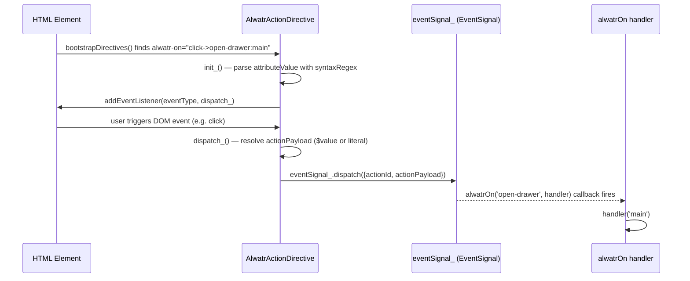
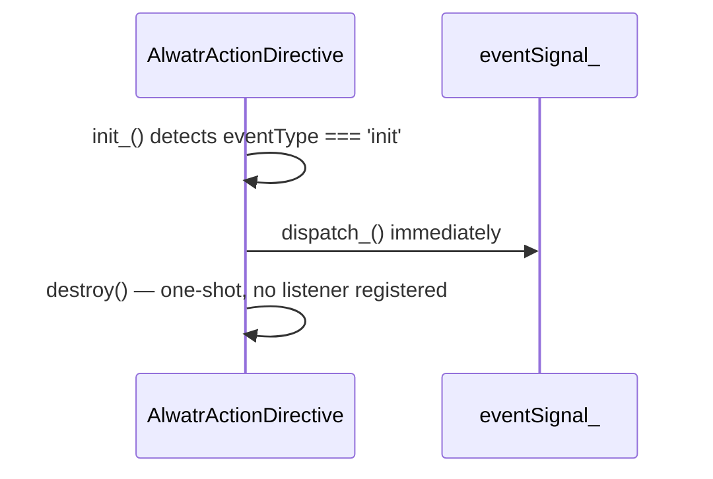

# Design Document: `@alwatr/on`

## Overview

`@alwatr/on` is a declarative DOM action-dispatch package that bridges HTML attributes to application-level signal handlers. It provides two primitives: `AlwatrActionDirective` — a `DirectiveBase` subclass that listens to DOM events and dispatches typed action signals — and `alwatrOn`, a subscription helper that lets any part of the app react to those actions by `actionId`.

---

## Main Algorithm / Workflow



Special case — `init` event type:



---

## Core Interfaces / Types

```typescript
/** Payload shape carried by the shared event signal. */
interface ActionPayload {
  /** Identifies which handler should react (e.g. 'open-drawer'). */
  actionId: string;
  /** Arbitrary string value forwarded to the handler. */
  actionPayload: string;
}

/** Return value of alwatrOn — wraps the signal subscription. */
type AlwatrOnSubscription = SubscribeResult; // { unsubscribe: () => void }
```

---

## Key Functions with Formal Specifications

### `AlwatrActionDirective.init_()`

```typescript
protected init_(): void
```

**Preconditions:**

- `this.attributeValue` is a non-empty string
- `syntaxRegex` is compiled and available

**Postconditions:**

- If `attributeValue` does not match `syntaxRegex`: logs an accident, returns without side effects
- If `eventType === 'init'`: dispatches once, calls `destroy()`, no DOM listener registered
- Otherwise: `dispatch_` is bound and registered via `addEventListener(eventType, dispatch_)`, and a destroy hook removes it

**Loop Invariants:** N/A

---

### `AlwatrActionDirective.dispatch_(event?)`

```typescript
protected dispatch_(event?: Event): void
```

**Preconditions:**

- `this.match` is non-null (guaranteed by `init_` guard)
- `this.element_` is a connected `HTMLElement`

**Postconditions:**

- `event.preventDefault()` is called when `event` is provided
- `actionId` is `this.match[2]`
- `actionPayload` is resolved:
  - `this.match[3]` if present and not `'$value'`
  - `(this.element_ as HTMLInputElement).value` if `this.match[3] === '$value'`
  - `''` if `this.match[3]` is absent
- `eventSignal_.dispatch({actionId, actionPayload})` is called exactly once

**Loop Invariants:** N/A

---

### `alwatrOn(actionId, handler)`

```typescript
function alwatrOn(actionId: string, handler: (payload: string) => void): SubscribeResult;
```

**Preconditions:**

- `actionId` is a non-empty string
- `handler` is a callable function

**Postconditions:**

- Returns a `SubscribeResult` with an `unsubscribe` method
- `handler` is called with `payload.actionPayload` whenever `eventSignal_` dispatches a payload where `payload.actionId === actionId`
- `handler` is NOT called for dispatches with a different `actionId`
- Calling `result.unsubscribe()` stops future invocations of `handler`

**Loop Invariants:** N/A

---

## Algorithmic Pseudocode

### Attribute Syntax Parsing

```pascal
ALGORITHM parseSyntax(attributeValue)
INPUT: attributeValue: string
OUTPUT: match: RegExpMatchArray | null

CONST syntaxRegex ← /^([a-z]+)->([a-z0-9-]+)(?::(.+))?$/

BEGIN
  match ← attributeValue.trim().match(syntaxRegex)
  RETURN match
  // match[1] = eventType  (e.g. 'click')
  // match[2] = actionId   (e.g. 'open-drawer')
  // match[3] = actionPayload literal or '$value' (optional)
END
```

### Directive Initialization

```pascal
ALGORITHM init_(directive)
INPUT: directive with attributeValue, element_, match

BEGIN
  IF match = null THEN
    logger.accident('init_', 'invalid_syntax', {attributeValue})
    RETURN
  END IF

  eventType ← match[1]

  IF eventType = 'init' THEN
    dispatch_()
    destroy()
    RETURN
  END IF

  BIND dispatch_ TO directive
  element_.addEventListener(eventType, dispatch_)
  addDestroyHook(() → element_.removeEventListener(eventType, dispatch_))
END
```

### Action Dispatch

```pascal
ALGORITHM dispatch_(directive, event?)
INPUT: directive with match, element_; optional DOM event

BEGIN
  IF event ≠ undefined THEN
    event.preventDefault()
  END IF

  actionId      ← match[2]
  rawPayload    ← match[3]

  IF rawPayload = '$value' AND 'value' IN element_ THEN
    actionPayload ← (element_ AS HTMLInputElement).value
  ELSE IF rawPayload ≠ undefined THEN
    actionPayload ← rawPayload
  ELSE
    actionPayload ← ''
  END IF

  eventSignal_.dispatch({actionId, actionPayload})
END
```

### Subscription Helper

```pascal
ALGORITHM alwatrOn(actionId, handler)
INPUT: actionId: string, handler: (payload: string) → void
OUTPUT: SubscribeResult

BEGIN
  RETURN eventSignal_.subscribe((payload) →
    IF payload.actionId = actionId THEN
      handler(payload.actionPayload)
    END IF
  )
END
```

---

## Example Usage

```typescript
import {bootstrapDirectives} from '@alwatr/directive';
import {alwatrOn} from '@alwatr/on';
import '@alwatr/on/directive'; // registers AlwatrActionDirective

// HTML: <button alwatr-on="click->open-drawer:main">Open</button>
// HTML: <input alwatr-on="input->search-query:$value" />
// HTML: <div alwatr-on="init->page-loaded"></div>

bootstrapDirectives();

// Subscribe to actions
const sub = alwatrOn('open-drawer', (payload) => {
  console.log('open drawer:', payload); // 'main'
});

alwatrOn('search-query', (query) => {
  console.log('search:', query); // live input value
});

// Cleanup when no longer needed
sub.unsubscribe();
```

---

## Correctness Properties

- **Syntax guard**: For any `attributeValue` that does not match `syntaxRegex`, `init_()` must not register any DOM listener and must not dispatch any signal.
- **One-shot init**: For `eventType === 'init'`, `dispatch_()` is called exactly once and the directive is immediately destroyed — no persistent listener.
- **Payload resolution**: `actionPayload` is `''` when `match[3]` is absent, the element's `.value` when `match[3] === '$value'`, and the literal string otherwise.
- **Listener cleanup**: Every `addEventListener` call in `init_()` has a corresponding `removeEventListener` registered via `addDestroyHook`.
- **Action isolation**: `alwatrOn(id, handler)` invokes `handler` only when `payload.actionId === id`; other action IDs are silently ignored.
- **Unsubscribe idempotency**: Calling `result.unsubscribe()` more than once must not throw.

---

## Error Handling

| Scenario                                  | Handling                                                  |
| ----------------------------------------- | --------------------------------------------------------- |
| Invalid `alwatr-on` attribute syntax      | `logger_.accident(...)` logged; directive silently no-ops |
| `$value` on non-input element             | Falls back to `''` (no `.value` property)                 |
| Signal dispatch after directive destroyed | Prevented by destroy hook removing the DOM listener       |
| Handler throws inside `alwatrOn`          | Propagates naturally (caller's responsibility)            |

---

## Dependencies

| Package             | Role                                                          |
| ------------------- | ------------------------------------------------------------- |
| `@alwatr/directive` | `DirectiveBase`, `directive` decorator, `bootstrapDirectives` |
| `@alwatr/signal`    | `createEventSignal`, `SubscribeResult`                        |
| `@alwatr/logger`    | Inherited via `DirectiveBase`                                 |
