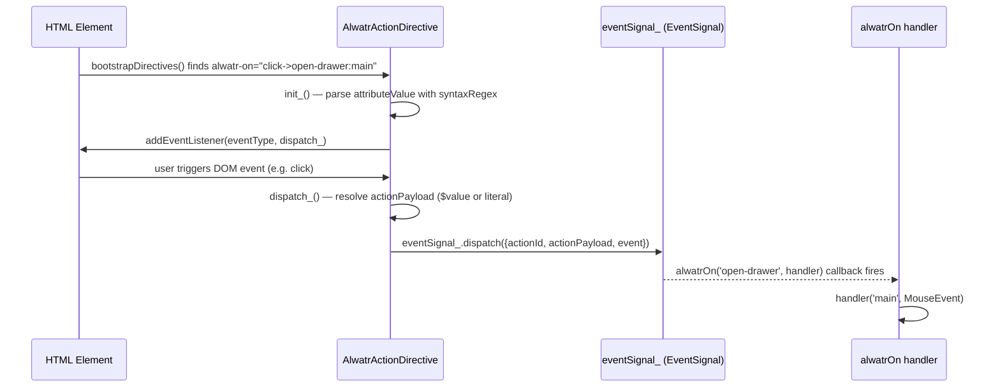
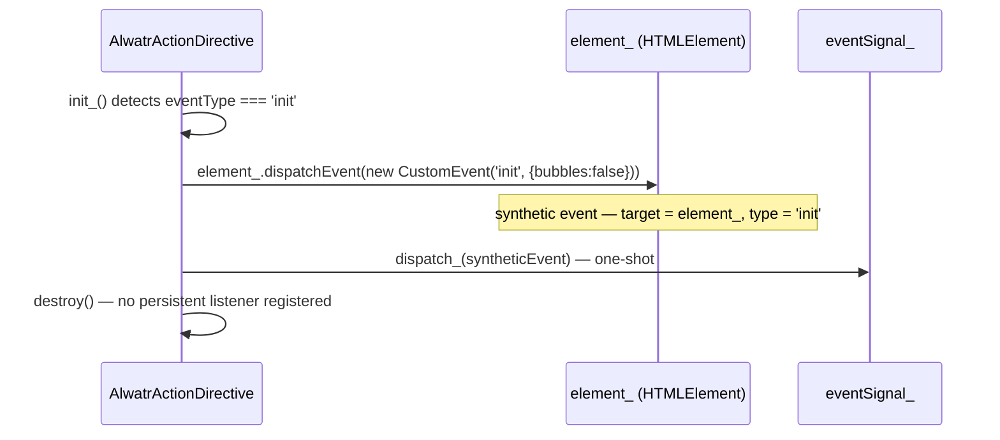

# Design Document: `@alwatr/on`

## Overview

`@alwatr/on` is a declarative DOM action-dispatch package that bridges HTML attributes to application-level signal handlers. It provides two primitives: `AlwatrActionDirective` — a `DirectiveBase` subclass that listens to DOM events and dispatches typed action signals — and `alwatrOn`, a subscription helper that lets any part of the app react to those actions by `actionId`.

---

## Main Algorithm / Workflow



Special case — `init` event type:



---

## Core Interfaces / Types

```typescript
/** Payload shape carried by the shared event signal. */
interface ActionPayload {
  /** Identifies which handler should react (e.g. 'open-drawer'). */
  actionId: string;
  /** Arbitrary string value forwarded to the handler. */
  actionPayload: string;
  /**
   * The DOM event that triggered this dispatch.
   *
   * For standard DOM event types (e.g. 'click', 'input'), this is the original browser Event.
   * For the special 'init' event type, this is a synthetic CustomEvent dispatched on the element
   * via `element_.dispatchEvent(new CustomEvent('init', {bubbles: false, cancelable: false}))`,
   * so `event.target === element_` and `event.type === 'init'`.
   *
   * The field is always present — never undefined.
   */
  event: Event;
}

/** Return value of alwatrOn — wraps the signal subscription. */
type AlwatrOnSubscription = SubscribeResult; // { unsubscribe: () => void }
```

---

## Key Functions with Formal Specifications

### `AlwatrActionDirective.init_()`

```typescript
protected init_(): void
```

**Preconditions:**

- `this.attributeValue` is a non-empty string
- `syntaxRegex` is compiled and available

**Postconditions:**

- If `attributeValue` does not match `syntaxRegex`: logs an accident, returns without side effects
- If `eventType === 'init'`: dispatches once, calls `destroy()`, no DOM listener registered
- Otherwise: `dispatch_` is bound and registered via `addEventListener(eventType, dispatch_)`, and a destroy hook removes it

**Loop Invariants:** N/A

---

### `AlwatrActionDirective.dispatch_(event)`

```typescript
protected dispatch_(event: Event): void
```

**Preconditions:**

- `this.match` is non-null (guaranteed by `init_` guard)
- `this.element_` is a connected `HTMLElement`
- `event` is always a valid `Event` instance (real DOM event or synthetic `CustomEvent('init')`)

**Postconditions:**

- `event.preventDefault()` is called via optional chaining (`event?.preventDefault()`)
- `actionId` is `this.match[2]`
- `actionPayload` is resolved:
  - `(this.element_ as {value: string}).value` if `this.match[3] === '$value'` and `'value' in this.element_`
  - `this.match[3]` if present and not `'$value'`
  - `''` if `this.match[3]` is absent
- `eventSignal_.dispatch({actionId, actionPayload, event})` is called exactly once — `event` is always present

**Loop Invariants:** N/A

---

### `alwatrOn(actionId, handler)`

```typescript
function alwatrOn(actionId: string, handler: (payload: string, event: Event) => void): SubscribeResult;
```

**Preconditions:**

- `actionId` is a non-empty string
- `handler` is a callable function

**Postconditions:**

- Returns a `SubscribeResult` with an `unsubscribe` method
- `handler` is called with `(payload.actionPayload, payload.event)` whenever `eventSignal_` dispatches a payload where `payload.actionId === actionId`
- `event` is always a valid `Event` — either a real DOM event or a synthetic `CustomEvent('init')` with `target === element_`
- `handler` is NOT called for dispatches with a different `actionId`
- Calling `result.unsubscribe()` stops future invocations of `handler`

**Loop Invariants:** N/A

---

## Algorithmic Pseudocode

### Attribute Syntax Parsing

```pascal
ALGORITHM parseSyntax(attributeValue)
INPUT: attributeValue: string
OUTPUT: match: RegExpMatchArray | null

CONST syntaxRegex ← /^([a-z]+)->([a-z0-9-]+)(?::(.+))?$/

BEGIN
  match ← attributeValue.trim().match(syntaxRegex)
  RETURN match
  // match[1] = eventType  (e.g. 'click')
  // match[2] = actionId   (e.g. 'open-drawer')
  // match[3] = actionPayload literal or '$value' (optional)
END
```

### Directive Initialization

```pascal
ALGORITHM init_(directive)
INPUT: directive with attributeValue, element_, match

BEGIN
  IF match = null THEN
    logger.accident('init_', 'invalid_syntax', {attributeValue})
    RETURN
  END IF

  eventType ← match[1]

  IF eventType = 'init' THEN
    // Synthesize a real CustomEvent so event.target = element_ and event.type = 'init'
    syntheticEvent ← new CustomEvent('init', {bubbles: false, cancelable: false})
    element_.dispatchEvent(syntheticEvent)
    dispatch_(syntheticEvent)
    destroy()
    RETURN
  END IF

  BIND dispatch_ TO directive
  element_.addEventListener(eventType, dispatch_)
  addDestroyHook(() → element_.removeEventListener(eventType, dispatch_))
END
```

### Action Dispatch

```pascal
ALGORITHM dispatch_(directive, event)
INPUT: directive with match, element_; Event (real or synthetic)

BEGIN
  // event is always present — real DOM event or synthetic CustomEvent('init')
  event.preventDefault()

  actionId      ← match[2]
  rawPayload    ← match[3]

  IF rawPayload = '$value' AND 'value' IN element_ THEN
    actionPayload ← (element_ AS {value: string}).value
  ELSE IF rawPayload ≠ undefined THEN
    actionPayload ← rawPayload
  ELSE
    actionPayload ← ''
  END IF

  eventSignal_.dispatch({actionId, actionPayload, event})
END
```

### Subscription Helper

```pascal
ALGORITHM alwatrOn(actionId, handler)
INPUT: actionId: string, handler: (payload: string, event: Event) → void
OUTPUT: SubscribeResult

BEGIN
  RETURN eventSignal_.subscribe((payload) →
    IF payload.actionId = actionId THEN
      handler(payload.actionPayload, payload.event)
    END IF
  )
END
```

---

## Example Usage

```typescript
import {bootstrapDirectives} from '@alwatr/directive';
import {alwatrOn, registerAlwatrOnDirective} from '@alwatr/on';

registerAlwatrOnDirective();
bootstrapDirectives();

// HTML: <button alwatr-on="click->open-drawer:main">Open</button>
// HTML: <input alwatr-on="input->search-query:$value" />
// HTML: <div alwatr-on="init->page-loaded"></div>

// event is always a real Event — never undefined
const sub = alwatrOn('open-drawer', (payload, event) => {
  console.log('open drawer:', payload); // 'main'
  console.log('event type:', event.type); // 'click'
  console.log('target:', event.target); // <button>
});

alwatrOn('search-query', (query, event) => {
  console.log('search:', query); // live input value
  console.log('target tag:', (event.target as HTMLElement).tagName); // 'INPUT'
});

// For init — event is a synthetic CustomEvent, target = element_
alwatrOn('page-loaded', (payload, event) => {
  console.log('event type:', event.type); // 'init'
  console.log('target:', event.target); // <div alwatr-on="init->page-loaded">
});

sub.unsubscribe();
```

---

## Correctness Properties

_A property is a characteristic or behavior that should hold true across all valid executions of a system — essentially, a formal statement about what the system should do. Properties serve as the bridge between human-readable specifications and machine-verifiable correctness guarantees._

### Property 1: Syntax Guard — No Side Effects on Invalid Input

_For any_ `attributeValue` string that does not match `syntaxRegex`, calling `init_()` must not register any DOM listener and must not dispatch any signal on `eventSignal_`.

**Validates: Requirements 1.3**

---

### Property 2: Payload Resolution — Absent Segment

_For any_ `attributeValue` that matches `syntaxRegex` without a `:payload` segment, `actionPayload` in the dispatched `ActionPayload` must equal `""` (empty string).

**Validates: Requirements 4.1**

---

### Property 3: Payload Resolution — `$value` Token

_For any_ element with a `.value` property and any `attributeValue` whose `rawPayload` is `"$value"`, `actionPayload` in the dispatched `ActionPayload` must equal `element_.value` at the exact moment `dispatch_()` is called.

**Validates: Requirements 4.2**

---

### Property 4: Payload Resolution — Literal String

_For any_ `attributeValue` whose `rawPayload` is a non-empty string other than `"$value"`, `actionPayload` in the dispatched `ActionPayload` must equal that literal string unchanged.

**Validates: Requirements 4.3**

---

### Property 5: Listener Cleanup — Symmetric addEventListener / removeEventListener

_For any_ directive initialized with a non-`init` `eventType`, every `addEventListener(eventType, dispatch_)` call must have exactly one corresponding `removeEventListener(eventType, dispatch_)` call registered via `addDestroyHook` — no more, no less.

**Validates: Requirements 2.2, 2.3**

---

### Property 6: One-Shot `init` — Synthetic Event with Correct Target

_For any_ `attributeValue` where `eventType === "init"`, `init_()` must:

1. Create a `CustomEvent('init', {bubbles: false, cancelable: false})` and dispatch it on `element_` via `element_.dispatchEvent()`
2. Call `dispatch_(syntheticEvent)` exactly once with that synthetic event
3. Call `destroy()` immediately after
4. Not call `addEventListener` at any point

The resulting `payload.event` in the signal must have `event.type === 'init'` and `event.target === element_`.

**Validates: Requirements 3.1, 3.2, 3.3**

---

### Property 7: Action Isolation — Handler Invoked Only for Matching `actionId`

_For any_ `actionId` string passed to `alwatrOn`, and _for any_ `ActionPayload` dispatched on `eventSignal_` where `payload.actionId !== actionId`, the registered `handler` must not be invoked.

**Validates: Requirements 6.1, 6.3**

---

### Property 8: Unsubscribe Stops Handler Invocations

_For any_ subscription returned by `alwatrOn`, after `result.unsubscribe()` is called, _for any_ subsequent dispatch on `eventSignal_` (regardless of `actionId`), the `handler` must not be invoked.

**Validates: Requirements 6.4**

---

### Property 9: `event.preventDefault()` Called for All DOM-Triggered Dispatches

_For any_ DOM `Event` object passed to `dispatch_()`, `event.preventDefault()` must be called before `eventSignal_.dispatch(...)` is invoked.

**Validates: Requirements 5.1**

---

### Property 10: Event Forwarding — DOM Event Reaches `alwatrOn` Handler

_For any_ `Event` passed to `dispatch_()` (real DOM event or synthetic `CustomEvent('init')`), the same `Event` instance must be present as `payload.event` in the signal and forwarded as the second argument to the matching `alwatrOn` handler. The `event` field is always a valid `Event` — never `undefined`.

**Validates: Requirements 5.2, 6.1**

---

## Error Handling

| Scenario                                  | Handling                                                  |
| ----------------------------------------- | --------------------------------------------------------- |
| Invalid `alwatr-on` attribute syntax      | `logger_.accident(...)` logged; directive silently no-ops |
| `$value` on non-input element             | Falls back to `''` (no `.value` property)                 |
| Signal dispatch after directive destroyed | Prevented by destroy hook removing the DOM listener       |
| Handler throws inside `alwatrOn`          | Propagates naturally (caller's responsibility)            |

---

## Dependencies

| Package             | Role                                                          |
| ------------------- | ------------------------------------------------------------- |
| `@alwatr/directive` | `DirectiveBase`, `directive` decorator, `bootstrapDirectives` |
| `@alwatr/signal`    | `createEventSignal`, `SubscribeResult`                        |
| `@alwatr/logger`    | Inherited via `DirectiveBase`                                 |
