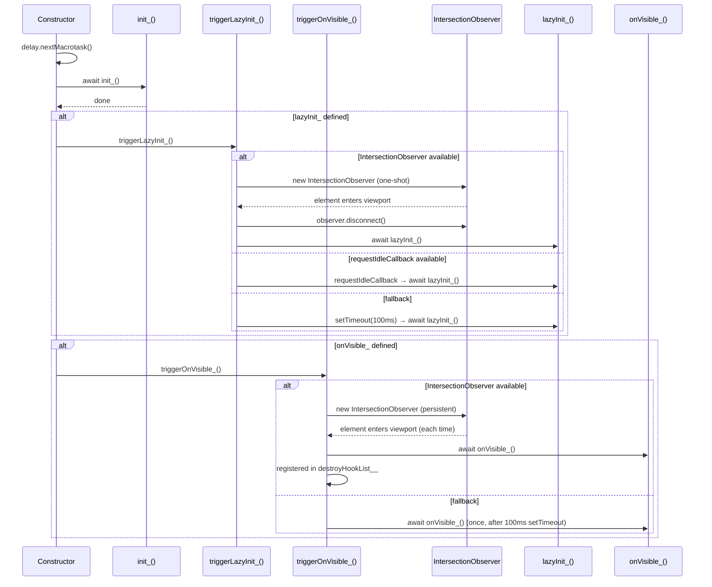

# Design Document: lazy-init-directive

## Overview

افزودن lifecycle hook های اختیاری به کلاس `DirectiveBase` در پکیج `@alwatr/directive`:

| Hook           | اجرا                                   | تعداد دفعات  |
| -------------- | -------------------------------------- | ------------ |
| `init_()`      | بعد از nextMacrotask (optional)        | دقیقاً ۱ بار |
| `lazyInit_()`  | اولین بار که element وارد viewport شود | دقیقاً ۱ بار |
| `onVisible_()` | هر بار که element وارد viewport شود    | نامحدود      |
| `onHidden_()`  | هر بار که element از viewport خارج شود | نامحدود      |

`init_()` به optional تبدیل شده — directive هایی که فقط از `@on` decorator یا visibility hook استفاده می‌کنند نیازی به تعریف آن ندارند.

`lazyInit_` در صورت عدم پشتیبانی به `requestIdleCallback` و سپس `setTimeout(100ms)` fallback می‌کند. `onVisible_` در صورت عدم پشتیبانی با `setTimeout(100ms)` یک بار اجرا می‌شود. `onHidden_` هیچ fallback ندارد.

`onVisible_` و `onHidden_` یک `IntersectionObserver` مشترک دارند تا از ساخت observer تکراری جلوگیری شود.

---

## Main Algorithm/Workflow



---

## Core Interfaces/Types

```typescript
/**
 * Optional lifecycle hook — runs once after next macrotask.
 * Use for: event listeners, initial DOM setup.
 */
protected init_?(): Awaitable<void>;

/**
 * Optional lifecycle hook — runs ONCE when the element first enters the viewport.
 * Falls back to requestIdleCallback or setTimeout(100ms) if IntersectionObserver is unavailable.
 *
 * Use for: lazy loading images, fetching data, heavy DOM setup.
 */
protected lazyInit_?(): Awaitable<void>;

/**
 * Optional lifecycle hook — runs EVERY TIME the element enters the viewport.
 * Falls back to a single execution via setTimeout(100ms) if IntersectionObserver is unavailable.
 *
 * Use for: impression tracking, restarting animations, refreshing dynamic data.
 */
protected onVisible_?(): Awaitable<void>;

/**
 * Optional lifecycle hook — runs EVERY TIME the element leaves the viewport.
 * No fallback — silently skipped if IntersectionObserver is unavailable.
 *
 * Use for: pausing video/audio, cancelling in-progress work, hiding UI.
 */
protected onHidden_?(): Awaitable<void>;

/**
 * Handles one-shot lazy execution with environment-aware fallbacks.
 */
private triggerLazyInit_(): void;

/**
 * Handles persistent visibility tracking for both onVisible_ and onHidden_.
 * Creates a single shared IntersectionObserver for both hooks.
 */
private triggerVisibilityObserver_(): void;
```

---

## Key Functions with Formal Specifications

### Constructor (modified)

```typescript
constructor(element: HTMLElement, attributeName: string)
```

**Preconditions:**

- `element` is a valid, connected `HTMLElement`
- `attributeName` is a non-empty string

**Postconditions:**

- `init_()` is called after `delay.nextMacrotask()`
- اگر `lazyInit_` تعریف شده باشد، `triggerLazyInit_()` بلافاصله پس از `init_()` فراخوانی می‌شود
- اگر `onVisible_` تعریف شده باشد، `triggerOnVisible_()` بلافاصله پس از `init_()` فراخوانی می‌شود
- هیچ side-effect ای قبل از `nextMacrotask` رخ نمی‌دهد

---

### `triggerLazyInit_()` (new private method)

```typescript
private triggerLazyInit_(): void
```

**Preconditions:**

- `this.lazyInit_` یک تابع است

**Postconditions:**

- دقیقاً یک بار `lazyInit_()` اجرا می‌شود
- اگر `IntersectionObserver` موجود باشد: observer پس از اولین intersection قطع می‌شود و در `destroyHookList__` ثبت می‌شود
- خطاهای داخل `lazyInit_()` با `logger_.error` لاگ می‌شوند و exception بالا نمی‌رود
- هیچ observer یا callback ای پس از اجرا باقی نمی‌ماند (leak-free)

---

### `triggerOnVisible_()` (new private method)

```typescript
private triggerOnVisible_(): void
```

**Preconditions:**

- `this.onVisible_` یک تابع است

**Postconditions:**

- هر بار که element وارد viewport شود، `onVisible_()` اجرا می‌شود
- observer در `destroyHookList__` ثبت می‌شود تا هنگام `destroy()` قطع شود
- خطاهای داخل `onVisible_()` با `logger_.error` لاگ می‌شوند و exception بالا نمی‌رود
- اگر `IntersectionObserver` موجود نباشد، یک بار با `setTimeout(100ms)` اجرا می‌شود

---

### `lazyInit_()` (optional hook for subclasses)

```typescript
protected lazyInit_?(): Awaitable<void>
```

**Preconditions:**

- `init_()` قبلاً کامل شده است
- element در viewport قرار دارد (یا fallback فعال شده)

**Postconditions:**

- عملیات lazy loading کامل شده
- DOM element به‌روز شده است

---

### `onVisible_()` (optional hook for subclasses)

```typescript
protected onVisible_?(): Awaitable<void>
```

**Preconditions:**

- `init_()` قبلاً کامل شده است
- element در viewport قرار دارد

**Postconditions:**

- عملیات مربوط به visibility (مثل impression tracking) انجام شده

---

## Algorithmic Pseudocode

### Modified Constructor Flow

```typescript
constructor(element: HTMLElement, attributeName: string) {
  // ... existing setup code ...

  (async () => {
    await delay.nextMacrotask();
    await this.init_?.();
    if (typeof this.lazyInit_ === 'function') {
      this.triggerLazyInit_();
    }
    if (typeof this.onVisible_ === 'function' || typeof this.onHidden_ === 'function') {
      this.triggerVisibilityObserver_();
    }
  })();
}
```

### `triggerLazyInit_` Algorithm

```typescript
private triggerLazyInit_(): void {
  const execute = async () => {
    try {
      await this.lazyInit_!();
    } catch (err) {
      this.logger_.error('triggerLazyInit_', 'error_in_lazy_init', err);
    }
  };

  if (typeof IntersectionObserver !== 'undefined') {
    const observer = new IntersectionObserver((entries) => {
      if (entries[0].isIntersecting) {
        observer.disconnect();
        void execute();
      }
    });
    observer.observe(this.element_);
    // Cleanup if destroy() is called before element enters viewport
    this.addDestroyHook(() => observer.disconnect());
  } else if (typeof requestIdleCallback !== 'undefined') {
    requestIdleCallback(() => void execute());
  } else {
    setTimeout(() => void execute(), 100);
  }
}
```

### `triggerVisibilityObserver_` Algorithm

```typescript
private triggerVisibilityObserver_(): void {
  if (typeof IntersectionObserver !== 'undefined') {
    const observer = new IntersectionObserver(async (entries) => {
      if (this.isDestroyed()) return;
      const entry = entries[0];
      if (entry.isIntersecting) {
        if (this.onVisible_) {
          try { await this.onVisible_(); }
          catch (err) { this.logger_.error('triggerVisibilityObserver_', 'error_in_on_visible', err); }
        }
      } else {
        if (this.onHidden_) {
          try { await this.onHidden_(); }
          catch (err) { this.logger_.error('triggerVisibilityObserver_', 'error_in_on_hidden', err); }
        }
      }
    });
    observer.observe(this.element_);
    // Single cleanup entry for both hooks
    this.addDestroyHook(() => observer.disconnect());
  } else if (this.onVisible_) {
    // Fallback: run onVisible_ once after 100ms. onHidden_ has no meaningful fallback.
    setTimeout(async () => {
      try { await this.onVisible_!(); }
      catch (err) { this.logger_.error('triggerVisibilityObserver_', 'error_in_on_visible', err); }
    }, 100);
  }
}
```

---

## DX Comparison

|                     | `init_()?`                  | `lazyInit_()?`                   | `onVisible_()?`                        | `onHidden_()?`           |
| ------------------- | --------------------------- | -------------------------------- | -------------------------------------- | ------------------------ |
| **زمان اجرا**       | بعد از nextMacrotask        | اولین بار در viewport            | هر بار در viewport                     | هر بار خروج از viewport  |
| **تعداد اجرا**      | ۱ بار                       | ۱ بار                            | نامحدود                                | نامحدود                  |
| **مناسب برای**      | event listener، setup اولیه | lazy load تصویر، fetch داده      | impression tracking، animation restart | pause video، cancel work |
| **cleanup خودکار**  | —                           | ✅                               | ✅ (shared observer)                   | ✅ (shared observer)     |
| **error isolation** | —                           | ✅                               | ✅                                     | ✅                       |
| **fallback**        | —                           | requestIdleCallback → setTimeout | setTimeout(100ms)                      | ندارد                    |

---

## Example Usage

```typescript
import {directive, DirectiveBase} from '@alwatr/directive';

@directive('product-card-tracker')
export class ProductCardTrackerDirective extends DirectiveBase {
  // ۱. اجرای فوری — event listener وصل می‌کنیم
  protected override init_(): void {
    this.element_.addEventListener('click', this.handleClick_);
  }

  // ۲. اجرای یک‌بار با تأخیر — تصویر سنگین رو lazy load می‌کنیم
  protected override lazyInit_(): void {
    const img = this.element_.querySelector('img')!;
    img.src = img.dataset['src']!;
  }

  // ۳. اجرای تکرارشونده — هر بار که کارت دیده شد impression می‌فرستیم
  protected override onVisible_(): void {
    AnalyticsService.sendImpression(this.attributeValue);
  }

  // ۴. هر بار که کارت از دید خارج شد
  protected override onHidden_(): void {
    AnalyticsService.sendHidden(this.attributeValue);
  }

  private handleClick_ = () => {
    /* ... */
  };
}
```

```typescript
// فقط lazyInit_ — بدون onVisible_
@directive('my-product-price')
export class ProductPriceDirective extends DirectiveBase {
  protected override init_(): void {
    this.element_.classList.add('loading-skeleton');
  }

  protected override async lazyInit_(): Promise<void> {
    const price = await fetchPrice(this.attributeValue);
    this.element_.classList.remove('loading-skeleton');
    this.element_.textContent = price;
  }
}
```

---

## Correctness Properties

- **lazyInit single execution**: `lazyInit_()` برای هر instance دقیقاً یک بار اجرا می‌شود
- **onVisible repeated execution**: `onVisible_()` هر بار که element وارد viewport شود اجرا می‌شود
- **onHidden repeated execution**: `onHidden_()` هر بار که element از viewport خارج شود اجرا می‌شود
- **Shared observer**: `onVisible_` و `onHidden_` یک `IntersectionObserver` مشترک دارند
- **Order guarantee**: هر hook همیشه پس از تکمیل `init_()` اجرا می‌شود
- **Backward compatibility**: directive هایی که هیچ‌کدام از hookها را ندارند رفتار قبلی را حفظ می‌کنند
- **Error isolation**: خطا در هر hook باعث crash directive یا سایر directive ها نمی‌شود
- **No memory leak**: observer های `lazyInit_` و visibility هر دو در `destroyHookList__` ثبت می‌شوند
- **lazyInit fallback chain**: `IntersectionObserver` → `requestIdleCallback` → `setTimeout(100ms)`
- **onVisible fallback**: `IntersectionObserver` → یک بار با `setTimeout(100ms)`
- **onHidden fallback**: ندارد — در محیط بدون `IntersectionObserver` اجرا نمی‌شود

---

## Error Handling

### خطا در `lazyInit_()` یا `onVisible_()`

**Condition**: exception در بدنه hook پرتاب شود  
**Response**: با `this.logger_.error(triggerMethodName, errorKey, err)` لاگ می‌شود  
**Recovery**: directive به کار خود ادامه می‌دهد

### Element از DOM حذف شود قبل از intersection

**Condition**: `destroy()` قبل از ورود element به viewport فراخوانی شود  
**Response**: observer از طریق `destroyHookList__` disconnect می‌شود  
**Recovery**: هیچ memory leak یا اجرای اضافه‌ای رخ نمی‌دهد

---

## Testing Strategy

### Unit Testing

- `lazyInit_` تعریف نشده → `triggerLazyInit_` فراخوانی نشود
- `onVisible_` تعریف نشده → `triggerOnVisible_` فراخوانی نشود
- `lazyInit_` تعریف شده → دقیقاً یک بار پس از `init_()` اجرا شود
- `onVisible_` تعریف شده → هر بار intersection اجرا شود
- خطا در هر hook → لاگ شود و exception بالا نرود
- `destroy()` قبل از intersection → observer disconnect شود

### Property-Based Testing

**Property Test Library**: `bun:test`

- برای هر directive با `lazyInit_`، ترتیب `init_` → `lazyInit_` همیشه حفظ شود
- برای هر directive با `onVisible_`، تعداد اجرا برابر تعداد intersection باشد
- برای هر directive بدون هیچ hook، رفتار قبلی تغییر نکند

### Integration Testing

- `IntersectionObserver` mock: element وارد viewport شود → `lazyInit_` یک بار، `onVisible_` هر بار اجرا شود
- `IntersectionObserver` غیرفعال: `lazyInit_` از fallback chain استفاده کند، `onVisible_` یک بار با `setTimeout(100ms)` اجرا شود
- `destroy()` قبل از intersection: هیچ hookی اجرا نشود

---

## Dependencies

- `@alwatr/delay` — برای `delay.nextMacrotask()` (موجود)
- `@alwatr/logger` — برای لاگ خطا (موجود)
- `IntersectionObserver` — Web API استاندارد
- `requestIdleCallback` — Web API (فقط برای `lazyInit_` fallback)
