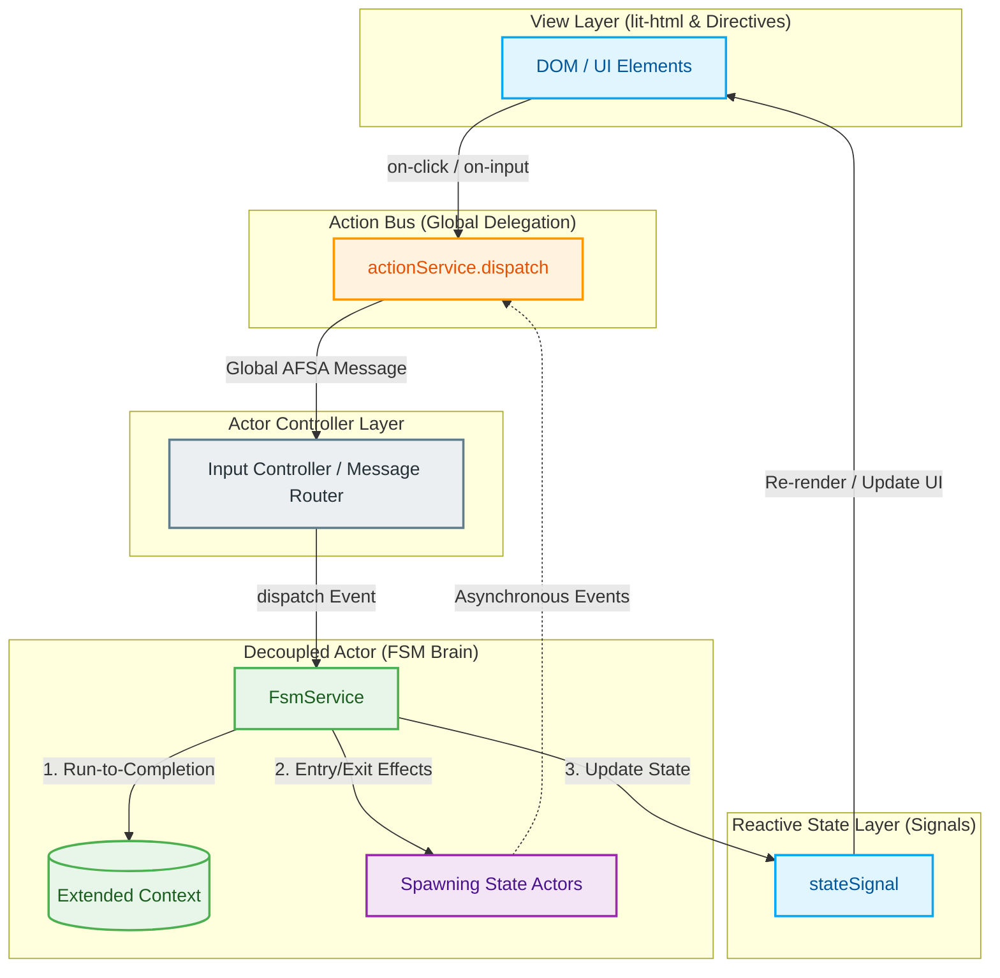

# 🌊 Alwatr Flux

**The Ultimate Unidirectional Data Flow Architecture for Modern Web Applications**

[](https://www.npmjs.com/package/@alwatr/flux)
[](https://github.com/Alwatr/alwatr/blob/next/LICENSE)

> A powerful, lightning-fast, zero-dependency reactive architecture bundle that brings together signals, actions, directives, and client-side storage into a cohesive, production-ready system for building scalable Progressive Web Applications.

---

## 🎯 What is Alwatr Flux?

`@alwatr/flux` is not just another state management library — it's a **complete architectural framework** that implements the **Unidirectional Data Flow (UDF)** pattern with unprecedented performance and developer experience.

Born from years of building production PWAs and inspired by the best ideas from React, Qwik, Solid.js, and Svelte, Flux combines:

- **Fine-grained reactivity** via Signals (no Virtual DOM overhead)
- **Global event delegation** for O(1) boot time (inspired by Qwik's Resumability)
- **Declarative DOM directives** for clean, maintainable UI code
- **Declarative reactive DOM data binding** via Bind (surgical view model updates)
- **Type-safe action bus** with zero runtime overhead
- **Persistent state management** with automatic localStorage/sessionStorage sync

All in a **tree-shakeable, ESM-only** package that adds **less than 15KB** to your production bundle.

---

## 🧠 Core Philosophy

Alwatr Flux is built on three fundamental engineering principles:

### 1. **Strict Unidirectional Data Flow**

Data flows in **one direction only**: `View → Action → Controller → State → View`

- **Views** never manipulate state directly
- **Controllers** never touch the DOM
- **State** is the single source of truth
- **Actions** are the only way to request changes

This creates a **zero-coupling architecture** where every layer is independently testable and replaceable.

### 2. **Simplicity Over Cleverness (KISS & YAGNI)**

Instead of heavy Virtual DOM reconciliation, we use:

- **`lit-html`** for efficient, lazy template rendering
- **Signals** for surgical, fine-grained reactivity
- **Global delegation** for O(1) event listener registration

No magic. No hidden re-renders. No performance cliffs.

### 3. **Absolute Type Safety**

Through TypeScript's **Declaration Merging**, the entire action bus is fully typed. Every action is a single **`Action<K>`** object (Alwatr Flux Standard Action — AFSA) carrying `type`, `payload`, `context`, and `meta`:

```typescript
// Define your actions once
declare module '@alwatr/flux' {
  interface ActionRecord {
    ui_add_to_cart: {productId: number; qty: number};
    ui_open_drawer: 'menu' | 'settings';
    ui_logout: void;
  }
}

// Get compile-time safety everywhere — handler receives the full Action object
actionService.on('ui_add_to_cart', (action) => {
  // action.payload is typed as {productId: number; qty: number}
  cartService.add(action.payload.productId, action.payload.qty);
  // action.context is the nearest [action_context] ancestor value (or undefined)
  console.log(action.context); // e.g. 'product-list'
});

actionService.dispatch({type: 'ui_add_to_cart', payload: {productId: 42, qty: 1}}); // ✅
actionService.dispatch({type: 'ui_add_to_cart', payload: 'wrong'}); // ❌ Compile error
```

---

## ✨ Key Features

### ⚡ **O(1) Event Delegation**

Inspired by Qwik's Resumability, Flux uses **global event delegation** to eliminate per-element listeners:

- **One listener per event type** on `document.body` (not N listeners for N elements)
- **Zero boot-time cost** — works instantly with server-rendered HTML
- **Automatic support for dynamic content** — elements added after page load work immediately
- **Memory usage near zero** — no listener references to track

**Result:** 100 buttons = 1 listener. 10,000 buttons = still 1 listener.

### 🎯 **Fine-Grained Reactivity**

Signals provide **surgical updates** without Virtual DOM diffing:

```typescript
import {createStateSignal, createComputedSignal, createEffect} from '@alwatr/flux';

// State
const firstName = createStateSignal({name: 'firstName', initialValue: 'Ali'});
const lastName = createStateSignal({name: 'lastName', initialValue: 'Mihandoost'});

// Computed (memoized, only recalculates when deps change)
const fullName = createComputedSignal({
  name: 'fullName',
  deps: [firstName, lastName],
  get: () => `${firstName.get()} ${lastName.get()}`,
});

// Effect (side-effect that runs when deps change)
createEffect({
  name: 'log-name',
  deps: [fullName],
  run: () => console.log(`Name: ${fullName.get()}`),
  runImmediately: true,
});

lastName.set('Smith'); // Only fullName and the effect re-run — nothing else
```

### 🧩 **Declarative HTML Syntax**

Connect DOM events to typed actions without writing JavaScript. Wrap elements in `[action_context]` to scope the same action type to different UI regions:

```html
<!-- Simple action -->
<button on-click="ui_open_drawer:menu">Menu</button>

<!-- Dynamic payload from input value -->
<input
  on-input="ui_search_query:$value"
  placeholder="Search..."
/>

<!-- Form submission with validation -->
<form
  on-submit="ui_submit_form:$formdata; prevent,validate"
  novalidate
>
  <input
    name="email"
    type="email"
    required
  />
  <button type="submit">Submit</button>
</form>

<!-- Checkbox state -->
<input
  type="checkbox"
  on-change="ui_toggle_feature:$checked"
/>

<!-- Fire once and remove -->
<button on-click="ui_track_impression:hero_banner; once">Learn More</button>

<!-- Context scoping — same action type, different regions -->
<section action_context="volume">
  <input
    type="range"
    on-input="ui_slider_change:$value"
  />
</section>
<section action_context="brightness">
  <input
    type="range"
    on-input="ui_slider_change:$value"
  />
</section>
```

```typescript
// Handler receives the full Action object — payload, context, and meta together
actionService.on('ui_slider_change', (action) => {
  if (action.context === 'volume') audioService.setVolume(Number(action.payload));
  if (action.context === 'brightness') displayService.setBrightness(Number(action.payload));
});
```

**Built-in modifiers:**

- `prevent` — calls `event.preventDefault()`
- `stop` — calls `event.stopPropagation()`
- `validate` — checks form validity before dispatch
- `once` — removes attribute after first fire

**Built-in payload resolvers:**

- `:$value` — reads `element.value`
- `:$formdata` — serializes nearest `<form>` to object
- `:$checked` — reads checkbox/radio state

### 🎨 **Attribute-Based Directives**

Attach TypeScript classes to DOM elements declaratively:

```typescript
import {Directive, directive} from '@alwatr/flux';

@directive('tooltip')
export class TooltipDirective extends Directive {
  protected init_(): void {
    // this.element_ is the DOM element
    // this.attributeValue is the attribute value
    this.element_.title = this.attributeValue;

    this.on_('mouseenter', this.show_);
    this.on_('mouseleave', this.hide_);
  }

  private show_(): void {
    console.log('Showing tooltip:', this.attributeValue);
  }

  private hide_(): void {
    console.log('Hiding tooltip');
  }
}
```

```html
<button tooltip="Save your changes">Save</button>
```

**Lifecycle hooks:**

- `init_()` — runs once after element is connected
- `lazyInit_()` — runs once when element enters viewport (lazy loading)
- `onVisible_()` — runs every time element enters viewport (impression tracking)
- `onHidden_()` — runs every time element leaves viewport (pause/cleanup)

### 💾 **Persistent State Management**

Signals that automatically sync with browser storage:

```typescript
import {PersistentStateSignal, SessionStateSignal} from '@alwatr/flux';

// Persists across browser sessions
const userPrefs = new PersistentStateSignal({
  name: 'user-preferences',
  schemaVersion: 1,
  initialValue: {theme: 'light', lang: 'en'},
  saveDebounceDelay: 500, // Debounce writes to avoid thrashing
});

// Persists only for current tab session
const formDraft = new SessionStateSignal({
  name: 'contact-form-draft',
  schemaVersion: 1,
  initialValue: {name: '', email: '', message: ''},
});

// Use like any other signal
userPrefs.set({theme: 'dark', lang: 'fa'});
console.log(userPrefs.get()); // {theme: 'dark', lang: 'fa'}

// Automatically saved to localStorage with debouncing
// Automatically loaded on next page load
```

**Features:**

- **Automatic versioning** — old schema versions are auto-cleared
- **Debounced writes** — prevents localStorage thrashing
- **Type-safe** — full TypeScript support
- **Migration-friendly** — bump `schemaVersion` to reset storage

### 🌐 **SSR State Hydration**

`@alwatr/embedded-data` bridges the gap between server-rendered HTML and client-side reactive state. The server embeds initial data as JSON inside `<script type="application/json">` tags; the client extracts, validates, and feeds it into signals — **zero extra HTTP round-trips, zero flash of empty content**.

```html
<!-- Server renders this into the HTML -->
<script
  type="application/json"
  data-user-profile
>
  {"userId": 42, "name": "Ali", "role": "admin"}
</script>
```

```typescript
import {EmbeddedDataCollector} from '@alwatr/flux';
import {lazy} from '@alwatr/lazy';

interface UserProfile {
  userId: number;
  name: string;
  role: 'admin' | 'user';
}

function isUserProfile(data: unknown): data is UserProfile {
  return typeof data === 'object' && data !== null && 'userId' in data;
}

// Lazy: extraction runs only when .value is first accessed — not at module load.
export const userProfile = lazy(() =>
  new EmbeddedDataCollector<UserProfile>('data-user-profile', isUserProfile).collect(),
);
```

```typescript
// Feed into a signal — the rest of the app reacts normally
import {createStateSignal} from '@alwatr/flux';

const userSignal = createStateSignal<UserProfile | null>({
  name: 'user',
  initialValue: userProfile.instance, // hydrated from DOM, no API call needed
});
```

**Why this matters:**

- **No flash of empty content** — state is available synchronously on first render
- **No extra API call** — server already sent the data in the HTML payload
- **SSR-safe** — `EmbeddedDataCollector` guards against missing `document` in Node.js/Bun
- **Memory-efficient** — script tag content is cleared after extraction (GC hint)
- **Type-safe** — optional type-guard validator ensures runtime safety

### 📄 **Page-Ready Signal for MPA**

Lightweight page identity system for Multi-Page Applications:

```html
<body page-id="home">
  <!-- Your content -->
</body>
```

```typescript
import {onPageReady, subscribePageReady, dispatchPageReady} from '@alwatr/flux';

// Subscribe to specific page
onPageReady('home', () => {
  console.log('Home page is ready');
  initHomePage();
});

// Subscribe to all pages
subscribePageReady((pageId) => {
  analytics.trackPageView(pageId);
});

// Call once at bootstrap
dispatchPageReady(); // Reads [page-id] attribute and notifies subscribers
```

### 🔄 **Signal Operators**

Transform signals with functional operators:

```typescript
import {createStateSignal, createDebouncedSignal, createFilteredSignal, createMappedSignal} from '@alwatr/flux';

const searchInput = createStateSignal({name: 'search', initialValue: ''});

// Debounce (wait 300ms after user stops typing)
const debouncedSearch = createDebouncedSignal(searchInput, {delay: 300});

// Filter (only emit non-empty values)
const validSearch = createFilteredSignal(debouncedSearch, {
  filter: (value) => value.trim().length > 0,
});

// Map (transform to API query)
const searchQuery = createMappedSignal(validSearch, {
  map: (value) => ({q: value, limit: 10}),
});

// React to final query
createEffect({
  deps: [searchQuery],
  run: () => fetchResults(searchQuery.get()),
});
```

### 🔗 **Declarative DOM Data Binding (Bind)**

Flux aggregates `@alwatr/bind` to provide a declarative, low-overhead way to bind elements directly to reactive view models. This enables surgical updates to text, values, and attributes without virtual DOM diffing or full-component re-renders.

```typescript
import {service_binding, createStateSignal} from '@alwatr/flux';

// 1. Create domain state signal
const userSignal = createStateSignal({
  name: 'user',
  initialValue: {firstName: 'Ali', lastName: 'Mihandoost', cart: [], progress: '30%'},
});

// 2. Project domain state to flat view model representation
service_binding.createViewModel('user', userSignal, (u) => ({
  firstName: u.firstName,
  fullName: `${u.firstName} ${u.lastName}`,
  cartIsEmpty: u.cart.length === 0,
  progress: u.progress,
}));
```

In your HTML, bind properties using declarative attributes:

```html
<!-- Text Content Binding -->
<h2 bind_text="user.fullName">Loading...</h2>

<!-- Value Binding with active cursor position preservation guard -->
<input
  type="text"
  bind_value="user.firstName"
  on-input="ui_edit_name:$value"
/>

<!-- Attribute Binding (boolean presence toggling / nullish removal) -->
<button bind_attrib="disabled=user.cartIsEmpty">Checkout</button>

<!-- CSS Custom Property (Variable) Binding (nullish removal support) -->
<div bind_css_var="--player-progress: user.progress"></div>

<!-- Lazy Binding (evaluated only when element enters viewport) -->
<div
  bind_text="user.fullName"
  lazy_bind
></div>
```

#### 🌟 Key Advantages of Bind

- **Cursor Preservation**: Writing to input values directly in other frameworks often resets the cursor caret to the end of the text. `@alwatr/bind` compares values and only writes to the DOM if the value changed, preserving typing cursor position perfectly.
- **Presence-Aware Attributes**: Binds attributes intelligently. A `boolean` value toggles attribute presence, a `nullish` value removes the attribute, and any other value sets the attribute as a string.
- **CSS Variable Binding**: Dynamically sets custom style properties on elements, facilitating performance-oriented animations, progress bars, themes, and dynamic layout variables.
- **Lazy Initialization**: Placing `lazy_bind` on elements defers signal subscription and DOM updates until the element physically intersects the viewport, optimizing rendering performance on large pages.

---

### 🤖 **Finite State Machine (FSM) & Actor Model**

Flux natively aggregates `@alwatr/fsm` to eliminate ad-hoc state variables, boolean flags, and race conditions. Instead of writing unpredictable, disjointed spaghetti code, you model your application's lifecycle as a **declarative, type-safe statechart**.

```typescript
import {createFsmService} from '@alwatr/flux';
import type {StateMachineConfig} from '@alwatr/flux';

// 1. Define strict Union Types for compile-time safety
type FetchState = 'idle' | 'loading' | 'success' | 'failed';
type FetchEvent = {type: 'FETCH'} | {type: 'SUCCESS'} | {type: 'ERROR'};
interface FetchContext {
  retries: number;
}

// 2. Configure the machine declaratively
const fetchConfig: StateMachineConfig<FetchState, FetchEvent, FetchContext> = {
  name: 'api-fetch-lifecycle',
  initial: 'idle',
  context: {retries: 0},
  states: {
    idle: {
      on: {FETCH: {target: 'loading'}},
    },
    loading: {
      on: {
        SUCCESS: {target: 'success', assigners: [({context}) => ({...context, retries: 0})]},
        ERROR: [
          // Guard evaluates condition; first matching transition branch is chosen
          {
            target: 'loading',
            guard: ({context}) => context.retries < 3,
            assigners: [({context}) => ({...context, retries: context.retries + 1})],
          },
          {target: 'failed'},
        ],
      },
    },
    success: {},
    failed: {
      on: {FETCH: {target: 'loading', assigners: [({context}) => ({...context, retries: 0})]}},
    },
  },
};

// 3. Create the reactive service (FSM Service instance)
export const fetchService = createFsmService(fetchConfig);

// 4. Surgical Reactivity: Subscribe to state changes in the view layer
fetchService.stateSignal.subscribe((state) => {
  console.log(`Current State: ${state.name}, Retries: ${state.context.retries}`);
});

// 5. Dispatch events to trigger atomic transitions
fetchService.dispatch({type: 'FETCH'});
```

#### 🛡️ Why is Flux FSM a Game-Changer?

- **Eliminates Race Conditions (Run-to-Completion)**: FSM events are queued and processed sequentially. Async callbacks from concurrent network fetches never overwrite or corrupt the state.
- **Prevents State Explosion**: Ad-hoc booleans (like `isLoading`, `isError`, `hasFetched`) scale exponentially (e.g., 5 booleans = 32 states). FSM forces you to define a finite set of **valid states and transitions** (e.g., exactly 4 states).
- **Embedded Actor Architecture**: Statecharts can spawn long-running, asynchronous, isolated lifecycles called **Actors** on state entry, complete with auto-cleanup on exit.
- **Declarative Synergy**: The FSM's internal `stateSignal` integrates flawlessly with the `@alwatr/flux` unidirectional loop, feeding directly into your rendering template.

---

## 🏗️ Architecture Overview

Flux implements a **strict layered architecture** where each layer has a single responsibility. It supports both standard Unidirectional Data Flow (UDF) and the decentralized **Actor Model** (where components/features behave as isolated micro-services powered by FSMs).

### 1. Unidirectional Data Flow (UDF) Layering

```
┌───────────────────────────────────────────────────────────┐
│                         VIEW LAYER                        │
│  (HTML templates, Directives, lit-html rendering)         │
│                                                           │
│  • Reads state from Signals                               │
│  • Dispatches Actions via on-<event> attributes           │
│  • Never manipulates state directly                       │
└──────────────────┬────────────────────────────────────────┘
                   │ on-click="ui_add_to_cart:42"
                   ▼
┌───────────────────────────────────────────────────────────┐
│                       ACTION LAYER                        │
│  (@alwatr/action — Global Event Delegation + AFSA)        │
│                                                           │
│  • Captures DOM events via document.body listener         │
│  • Resolves [action_context] ancestor → action.context    │
│  • Parses on-<event> attributes                           │
│  • Runs modifiers (prevent, validate, once)               │
│  • Modifiers may enrich action.meta                       │
│  • Resolves payload ($value, $formdata)                   │
│  • Dispatches full Action {type, payload, context, meta}  │
└──────────────────┬────────────────────────────────────────┘
                   │ actionService.dispatch({type: 'ui_add_to_cart', payload: 42, context: 'cart'})
                   ▼
┌───────────────────────────────────────────────────────────┐
│                     CONTROLLER LAYER                      │
│  (Business Logic, Services, Use Cases)                    │
│                                                           │
│  • Subscribes to Actions via actionService.on()           │
│  • Receives full Action object (type, payload, context,   │
│    meta) — no need to pass context separately             │
│  • Executes business logic                                │
│  • Updates State via Signal.set()                         │
│  • Never touches DOM directly                             │
└──────────────────┬────────────────────────────────────────┘
                   │ cartSignal.set(newCart)
                   ▼
┌───────────────────────────────────────────────────────────┐
│                        STATE LAYER                        │
│  (@alwatr/signal — Reactive State Management)             │
│                                                           │
│  • StateSignal — mutable state                            │
│  • ComputedSignal — derived state (memoized)              │
│  • EffectSignal — side effects                            │
│  • PersistentStateSignal — localStorage sync              │
│  • SessionStateSignal — sessionStorage sync               │
└──────────────────┬────────────────────────────────────────┘
                   │ signal.subscribe(render)
                   ▼
┌───────────────────────────────────────────────────────────┐
│                         VIEW LAYER                        │
│  (Re-render only affected DOM nodes)                      │
└───────────────────────────────────────────────────────────┘
```

### 2. Decoupled Actor Model Flow

In complex applications, you can structure features as **Actors** using `@alwatr/fsm` + `@alwatr/action`. An Actor maintains private local state, receives inbound event packets from the global action bus, and broadcasts changes asynchronously back to the ecosystem.



**Key architectural benefits:**

- **Zero coupling** — layers and actors communicate only through events, guaranteeing that features can be refactored, extended, or replaced without side effects.
- **Run-to-Completion (RTC)** — State machines evaluate transitions atomically in a synchronous queue. Race conditions are mathematically impossible.
- **High Testability** — Since business logic is isolated inside declarative statecharts (`StateMachineConfig`), you can test all transitions and side-effects in node/bun without mounting a DOM.
- **Surgical Reactivity** — Only the DOM elements bound to the FSM's `stateSignal` or Context properties re-render, keeping CPU usage and memory footprints exceptionally low.
- **AI-Agent and Developer Friendly** — The explicit separation of routing, transition, and effect layers provides clean boundaries that humans and AI agents can navigate with zero ambiguity.

---

## 🎯 The Action Object (AFSA)

Every action flowing through the bus — whether triggered from HTML attributes or dispatched programmatically — is a single **`Action<K>`** object (Alwatr Flux Standard Action):

```typescript
interface Action<K extends keyof ActionRecord> {
  /** Action identifier — must be a key of ActionRecord. */
  type: K;

  /**
   * DOM context from the nearest [action_context] ancestor.
   * undefined for programmatic dispatches or when no ancestor exists.
   * Example: 'product-list', 'checkout-form', 'volume-slider'
   */
  context?: string;

  /** Business payload — type is inferred from ActionRecord[K]. */
  payload: ActionRecord[K];

  /**
   * Open-ended metadata bag for cross-cutting concerns.
   * Modifiers in the delegation pipeline may write to this before
   * the action reaches subscribers.
   */
  meta?: Record<string, unknown>;
}
```

This unified structure replaces the previous two-argument `(id, payload)` API. Every handler now receives the full picture:

```typescript
actionService.on('ui_add_to_cart', (action) => {
  console.log(action.type); // 'ui_add_to_cart'
  console.log(action.payload); // {productId: 42, qty: 1} — fully typed
  console.log(action.context); // 'product-list' — from [action_context] ancestor
  console.log(action.meta); // {traceId: '…'} — set by modifiers, or undefined
});
```

Modifiers can enrich `meta` before the action reaches subscribers:

```typescript
import {actionService} from '@alwatr/flux';

actionService.registerModifier('trace', (_event, _element, action) => {
  action.meta ??= {};
  action.meta['traceId'] = crypto.randomUUID();
  return true;
});
```

```html
<button on-click="ui_submit_order:42; trace">Place Order</button>
```

---

## 📦 Installation

```bash
# npm
npm install @alwatr/flux

# yarn
yarn add @alwatr/flux

# pnpm
pnpm add @alwatr/flux

# bun
bun add @alwatr/flux
```

**Zero dependencies.** Everything you need is included.

---

## 🚀 Quick Start

### 1. Bootstrap the Application

```typescript
import {actionService, dispatchPageReady} from '@alwatr/flux';

// Activate global event delegation (call once at app start)
actionService.setupDelegation();

// Dispatch page-ready signal (for MPA routing)
dispatchPageReady();
```

### 2. Define Your Actions (Type Safety)

```typescript
// src/actions.ts
declare module '@alwatr/flux' {
  interface ActionRecord {
    ui_increment: void;
    ui_decrement: void;
    ui_set_count: number;
  }
}
```

### 3. Create State

```typescript
// src/state.ts
import {createStateSignal} from '@alwatr/flux';

export const counterSignal = createStateSignal({
  name: 'counter',
  initialValue: 0,
});
```

### 4. Wire Up Controllers

```typescript
// src/controllers.ts
import {actionService} from '@alwatr/flux';
import {counterSignal} from './state.js';

actionService.on('ui_increment', () => {
  counterSignal.update((count) => count + 1);
});

actionService.on('ui_decrement', () => {
  counterSignal.update((count) => count - 1);
});

// Handler receives the full Action object — payload is typed from ActionRecord
actionService.on('ui_set_count', (action) => {
  counterSignal.set(action.payload); // action.payload: number
});
```

### 5. Build the View

```html
<!DOCTYPE html>
<html>
  <body>
    <div id="app">
      <h1>
        Counter:
        <span id="count">0</span>
      </h1>
      <button on-click="ui_decrement">-</button>
      <button on-click="ui_increment">+</button>
      <input
        type="number"
        on-input="ui_set_count:$value"
        value="0"
      />
    </div>

    <script
      type="module"
      src="./main.js"
    ></script>
  </body>
</html>
```

```typescript
// main.js
import {actionService} from '@alwatr/flux';
import {counterSignal} from './state.js';
import './controllers.js'; // Register action handlers

actionService.setupDelegation();

// Subscribe to state changes and update DOM
counterSignal.subscribe((count) => {
  document.getElementById('count').textContent = count;
});
```

**That's it!** You now have a fully reactive, type-safe counter with:

- ✅ Zero boilerplate
- ✅ Compile-time type safety
- ✅ O(1) event handling
- ✅ Fine-grained reactivity

---

## 📚 Complete API Reference

### Signals

#### `createStateSignal<T>(config)`

Creates a mutable state signal.

```typescript
const count = createStateSignal({
  name: 'count',
  initialValue: 0,
});

count.get(); // 0
count.set(1);
count.update((n) => n + 1);
count.subscribe((value) => console.log(value));
```

#### `createEventSignal<T>(config)`

Creates a stateless event signal (no value, only notifications).

```typescript
const onClick = createEventSignal({name: 'click'});

onClick.subscribe(() => console.log('Clicked!'));
onClick.dispatch(); // Notify all subscribers
```

#### `createComputedSignal<T>(config)`

Creates a derived signal (memoized, recalculates only when deps change).

```typescript
const fullName = createComputedSignal({
  name: 'fullName',
  deps: [firstName, lastName],
  get: () => `${firstName.get()} ${lastName.get()}`,
});

// IMPORTANT: Must call destroy() when done
fullName.destroy();
```

#### `createEffect(config)`

Runs side effects when dependencies change.

```typescript
const effect = createEffect({
  name: 'logger',
  deps: [count],
  run: () => console.log('Count:', count.get()),
  runImmediately: true,
});

// IMPORTANT: Must call destroy() when done
effect.destroy();
```

#### `PersistentStateSignal<T>` / `SessionStateSignal<T>`

State signals that sync with browser storage.

```typescript
const prefs = new PersistentStateSignal({
  name: 'user-prefs',
  schemaVersion: 1,
  initialValue: {theme: 'light'},
  saveDebounceDelay: 500,
});

prefs.set({theme: 'dark'}); // Auto-saved to localStorage
prefs.remove(); // Clear from storage
```

#### Signal Operators

```typescript
// Debounce
const debounced = createDebouncedSignal(source, {delay: 300});

// Filter
const filtered = createFilteredSignal(source, {
  filter: (value) => value > 0,
});

// Map
const mapped = createMappedSignal(source, {
  map: (value) => value * 2,
});
```

#### `createFsmService(config)`

Instantiates a Finite State Machine service using the given configuration:

```typescript
import {createFsmService} from '@alwatr/flux';

const myService = createFsmService({
  name: 'my-fsm',
  initial: 'idle',
  context: {retries: 0},
  states: {
    idle: {
      on: {START: {target: 'working'}},
    },
    working: {
      on: {SUCCESS: {target: 'idle'}},
    },
  },
});
```

See the complete [FSM Package README](https://github.com/Alwatr/alwatr/tree/next/pkg/fsm#readme) for advanced FSM configuration details (Persistence, Guards, Actors, etc.).

---

### Actions

#### `actionService`

The pre-instantiated singleton instance of `ActionService` exported for declarative event delegation and action dispatching.

##### `actionService.setupDelegation(eventTypes?)`

Activates global event delegation capture listeners on `document.body`.

```typescript
import {actionService, DEFAULT_DELEGATED_EVENTS} from '@alwatr/flux';

// Use defaults (click, submit, input, change)
actionService.setupDelegation();

// Or add custom events
actionService.setupDelegation([...DEFAULT_DELEGATED_EVENTS, 'keydown', 'focus']);
```

##### `actionService.on(type, handler)`

Subscribes to a single typed action or an array of actions.

```typescript
// Subscribe to a single action
const sub = actionService.on('ui_add_to_cart', (action) => {
  cartService.add(action.payload.productId, action.payload.qty);
  console.log(action.context); // e.g. 'product-list' or undefined
  console.log(action.meta); // any metadata set by modifiers
});

// Subscribe to multiple actions with a single handler
const multiSub = actionService.on(['ui_increment', 'ui_decrement'], (action) => {
  console.log('Action triggered:', action.type);
});

sub.unsubscribe(); // Clean up when done
multiSub.unsubscribe();
```

##### `actionService.dispatch(action)`

Dispatches a typed action programmatically.

```typescript
actionService.dispatch({type: 'navigate', payload: '/home'});
actionService.dispatch({type: 'auth_expired', payload: undefined}); // void payload

// With context and meta
actionService.dispatch({
  type: 'upload_complete',
  payload: fileId,
  context: 'product-list',
  meta: {source: 'recommendation'},
});
```

##### `actionService.registerModifier(name, handler)`

Adds a custom modifier for `on-<event>` attributes.

```typescript
actionService.registerModifier('confirm', () => {
  return window.confirm('Are you sure?');
});

// A modifier that stamps a trace ID into meta
actionService.registerModifier('trace', (_event, _element, action) => {
  action.meta ??= {};
  action.meta['traceId'] = crypto.randomUUID();
  return true;
});
```

```html
<button on-click="ui_delete_item:42; confirm,trace">Delete</button>
```

##### `actionService.registerPayloadResolver(name, resolver)`

Adds a custom payload resolver.

```typescript
actionService.registerPayloadResolver('$data-id', (_event, element) => {
  return element.dataset.id;
});
```

```html
<button
  on-click="ui_select:$data-id"
  data-id="42"
>
  Select
</button>
```

---

### Directives

#### `@directive(name)` / `lazyDirective(name, Class)`

Registers a directive class.

```typescript
import {Directive, directive} from '@alwatr/flux';

// Eager registration (side effect at import)
@directive('my-directive')
export class MyDirective extends Directive {
  protected init_(): void {
    console.log('Element:', this.element_);
    console.log('Attribute value:', this.attributeValue);
  }
}

// Lazy registration (tree-shakeable)
export class MyDirective extends Directive {
  /* ... */
}
export const registerMyDirective = lazyDirective('my-directive', MyDirective);

// In consumer code:
registerMyDirective();
bootstrapDirectives();
```

#### `bootstrapDirectives()`

Scans the DOM and instantiates all registered directives.

```typescript
import {bootstrapDirectives} from '@alwatr/flux';

bootstrapDirectives(); // Call after DOM is ready
```

#### Directive Lifecycle

```typescript
class MyDirective extends Directive {
  // Runs once after element is connected
  protected init_(): void {}

  // Runs once when element enters viewport (lazy loading)
  protected lazyInit_(): void {}

  // Runs every time element enters viewport
  protected onVisible_(): void {}

  // Runs every time element leaves viewport
  protected onHidden_(): void {}
}
```

#### Directive Utility Decorators

```typescript
import {Directive, directive, query, queryAll, attribute, on} from '@alwatr/flux';

@directive('my-form')
class FormDirective extends Directive {
  @query('.submit-btn')
  accessor submitBtn!: HTMLButtonElement | null;

  @queryAll('input')
  accessor inputs!: NodeListOf<HTMLInputElement>;

  @attribute('data-form-id')
  accessor formId!: string | null;

  protected init_(): void {
    this.on_('submit', this.handleSubmit_);
  }

  private handleSubmit_(event: Event): void {
    event.preventDefault();
    console.log('Form submitted:', this.formId);
  }
}
```

---

### Bind (Declarative Data Binding)

#### `setupBindDirectives()`

Registers and bootstraps all `@alwatr/bind` attribute directives on application boot.

```typescript
import {setupBindDirectives} from '@alwatr/flux';

setupBindDirectives();
```

#### `service_binding`

The registry singleton managing presentation view models and mapping subscriptions.

##### `service_binding.createViewModel(namespace, sourceSignal, project)`

Registers a ViewModel namespaces mapping a domain signal state `S` to a flat presentation record `T`.

```typescript
import {service_binding} from '@alwatr/flux';

service_binding.createViewModel('user', userSignal, (u) => ({
  fullName: `${u.firstName} ${u.lastName}`,
  cartIsEmpty: u.cart.length === 0,
}));
```

##### `service_binding.getViewModel(namespace)`

Retrieves a registered ViewModel's computed signal. Returns `null` if the namespace is not registered.

##### `service_binding.removeViewModel(namespace)`

Destroys the ViewModel's computed signal and removes the namespace from the active registry.

#### Directives HTML Syntax

- **`bind_text="namespace.prop"`**
  Updates the element's `textContent` to the property value. Maps nullish values (`null`/`undefined`) to `''`.

- **`bind_value="namespace.prop"`**
  Updates input element values safely. Skips DOM writing if the element's value is already equal to the bound value to prevent caret cursor jumping in active text inputs.

- **`bind_attrib="attr1=namespace.prop1; attr2=namespace.prop2"`**
  Updates target DOM attributes.
  - A boolean value toggles the attribute's presence.
  - A nullish value (`null` or `undefined`) removes the attribute.
  - All other values are coerced to strings.

- **`lazy-bind`**
  When added to any element with the above bindings, defers initialization and signal subscription until the element physically intersects the viewport.

---

### Page Ready

#### `onPageReady(pageId, handler)`

Subscribes to a specific page becoming ready.

```typescript
onPageReady('home', () => {
  console.log('Home page ready');
});
```

#### `subscribePageReady(handler)`

Subscribes to all page-ready events.

```typescript
subscribePageReady((pageId) => {
  analytics.trackPageView(pageId);
});
```

#### `dispatchPageReady()`

Reads `[page-id]` attribute and notifies subscribers.

```typescript
dispatchPageReady(); // Call once at bootstrap
```

---

### Storage

#### `createLocalStorageProvider<T>(config)`

Creates a versioned localStorage provider.

```typescript
import {createLocalStorageProvider} from '@alwatr/flux';

const storage = createLocalStorageProvider({
  name: 'user-data',
  schemaVersion: 1,
});

storage.write({name: 'Ali', age: 30});
const data = storage.read(); // {name: 'Ali', age: 30} | null
storage.has(); // true
storage.remove();
```

#### `createSessionStorageProvider<T>(config)`

Same as `createLocalStorageProvider` but uses `sessionStorage`.

---

### Embedded Data

#### `EmbeddedDataCollector<T>`

Extracts, parses, and validates JSON embedded in `<script type="application/json">` DOM nodes. Designed for SSR state hydration — the server renders initial state into the HTML, the client reads it on boot without an extra HTTP round-trip.

```typescript
import {EmbeddedDataCollector} from '@alwatr/flux';

// HTML: <script type="application/json" data-config>{"apiUrl":"https://api.example.com"}</script>

const collector = new EmbeddedDataCollector<AppConfig>('data-config');
const config = collector.collect(); // AppConfig | null
```

**Constructor:**

```typescript
new EmbeddedDataCollector<T>(
  attributeName: string,           // HTML attribute to query (e.g. 'data-config')
  validator?: (data: unknown) => data is T  // optional type-guard
)
```

**`collect(): T | null`**

Runs the full extraction pipeline:

1. `querySelector('script[attributeName]')` — SSR-safe, returns `null` if `document` is undefined
2. Read `textContent`, then set it to `''` (GC hint)
3. `JSON.parse()`
4. Run `validator` if provided
5. Return typed data or `null` on any failure

**With type-guard validation:**

```typescript
import {EmbeddedDataCollector} from '@alwatr/flux';
import {createStateSignal} from '@alwatr/flux';

interface CartState {
  items: {id: number; qty: number}[];
  total: number;
}

function isCartState(data: unknown): data is CartState {
  return typeof data === 'object' && data !== null && Array.isArray((data as CartState).items);
}

// Extract once at boot, feed into signal
const collector = new EmbeddedDataCollector<CartState>('data-cart', isCartState);

const cartSignal = createStateSignal<CartState>({
  name: 'cart',
  initialValue: collector.collect() ?? {items: [], total: 0},
});
```

**Combine with `@alwatr/lazy` for deferred extraction:**

```typescript
import {lazy} from '@alwatr/lazy';
import {EmbeddedDataCollector} from '@alwatr/flux';

// Extraction is deferred until .instance is first accessed
export const serverConfig = lazy(() =>
  new EmbeddedDataCollector<ServerConfig>('data-server-config', isServerConfig).collect(),
);

// Somewhere in your bootstrap code:
const config = serverConfig.instance; // extracted here, cached forever
```

---

### Render State

#### `renderState<R, T>(state, renderRecord, thisArg?)`

Utility for state-based rendering (useful with FSM).

```typescript
import {renderState} from '@alwatr/flux';

const currentState = 'loading';

renderState(currentState, {
  idle: () => html`
    <p>Ready</p>
  `,
  loading: () => html`
    <p>Loading...</p>
  `,
  success: () => html`
    <p>Success!</p>
  `,
  error: () => html`
    <p>Error!</p>
  `,
  _default: 'idle', // Fallback
});
```

---

### Template (lit-html)

`@alwatr/flux` re-exports a curated subset of [`lit-html`](https://lit.dev/docs/libraries/standalone-templates/) so you can render efficient DOM templates without adding a separate dependency.

#### `html`

Tagged template literal that produces a `TemplateResult`. lit-html parses the template once and only updates the dynamic parts on subsequent renders.

```typescript
import {html} from '@alwatr/flux';

const greeting = (name: string) => html`
  <p>Hello, ${name}!</p>
`;
```

#### `render(value, container)`

Renders a `TemplateResult` (or any renderable value) into a DOM container. Subsequent calls efficiently patch only the changed parts.

```typescript
import {html, render} from '@alwatr/flux';

render(
  html`
    <h1>Hello World</h1>
  `,
  document.getElementById('app')!,
);
```

#### `noChange` / `nothing`

Sentinels for fine-grained control over part updates:

- **`noChange`** — leaves the current DOM value untouched (skips the update entirely)
- **`nothing`** — removes the node or attribute from the DOM

```typescript
import {html, noChange, nothing} from '@alwatr/flux';

const badge = (count: number | undefined) => html`
  <span class="badge">
    ${count === undefined ? nothing
    : count === 0 ? noChange
    : count}
  </span>
`;
```

#### `ifDefined(value)`

Renders the attribute only when `value` is not `undefined`; removes the attribute otherwise.

```typescript
import {html, ifDefined} from '@alwatr/flux';

const link = (href?: string) => html`
  <a href=${ifDefined(href)}>Click</a>
`;
```

#### `cache(value)`

Caches rendered templates keyed by their `TemplateResult` identity. Avoids re-parsing the template string when switching between a fixed set of templates (e.g. tab panels).

```typescript
import {html, cache} from '@alwatr/flux';

const panel = (tab: 'home' | 'settings') =>
  cache(
    tab === 'home' ?
      html`
        <home-panel></home-panel>
      `
    : html`
        <settings-panel></settings-panel>
      `,
  );
```

#### `classMap(classInfo)`

Efficiently toggles CSS classes from a `{[className]: boolean}` object. Only the classes present in the map are touched; others are left unchanged.

```typescript
import {html, classMap} from '@alwatr/flux';

const button = (isActive: boolean, isDisabled: boolean) => html`
  <button class=${classMap({active: isActive, disabled: isDisabled})}>Click</button>
`;
```

#### `when(condition, trueCase, falseCase?)`

Conditional rendering helper. Cleaner than ternary expressions for template branches.

```typescript
import {html, when} from '@alwatr/flux';

const status = (isLoading: boolean) => html`
  <div>
    ${when(
      isLoading,
      () => html`
        <spinner-element></spinner-element>
      `,
      () => html`
        <content-element></content-element>
      `,
    )}
  </div>
`;
```

---

## 🆚 Why Choose Alwatr Flux?

| Feature                | React + Redux            | Solid.js        | Svelte                   | **Alwatr Flux** 🌊                 |
| ---------------------- | ------------------------ | --------------- | ------------------------ | ---------------------------------- |
| **Boot Time**          | High (hydration)         | Medium          | Medium                   | **Near-zero** (global delegation)  |
| **Re-renders**         | Common (needs `useMemo`) | Rare            | Rare                     | **Never** (fine-grained signals)   |
| **Component Coupling** | Prop drilling / Context  | Props / Context | Props / Stores           | **Zero** (action bus)              |
| **Bundle Size**        | Large (~45KB)            | Medium (~7KB)   | Medium (~2KB + compiler) | **Small (~15KB)**                  |
| **Type Safety**        | Partial                  | Good            | Good                     | **Absolute** (declaration merging) |
| **Learning Curve**     | Steep                    | Medium          | Easy                     | **Easy** (familiar patterns)       |
| **SSR/SSG Support**    | Complex                  | Good            | Good                     | **Excellent** (resumable)          |
| **Dynamic Content**    | Needs re-hydration       | Works           | Works                    | **Works instantly**                |

---

## 🎓 Real-World Example: Todo App

```typescript
// actions.ts
declare module '@alwatr/flux' {
  interface ActionRecord {
    'ui_add_todo': string;
    'ui_toggle_todo': number;
    'ui_remove_todo': number;
  }
}

// state.ts
import {createStateSignal} from '@alwatr/flux';

interface Todo {
  id: number;
  text: string;
  done: boolean;
}

export const todosSignal = createStateSignal<Todo[]>({
  name: 'todos',
  initialValue: [],
});

// controllers.ts
import {actionService} from '@alwatr/flux';
import {todosSignal} from './state.js';

let nextId = 1;

actionService.on('ui_add_todo', (action) => {
  todosSignal.update((todos) => [
    ...todos,
    {id: nextId++, text: action.payload, done: false},
  ]);
});

actionService.on('ui_toggle_todo', (action) => {
  todosSignal.update((todos) =>
    todos.map((todo) =>
      todo.id === action.payload ? {...todo, done: !todo.done} : todo
    )
  );
});

actionService.on('ui_remove_todo', (action) => {
  todosSignal.update((todos) => todos.filter((t) => t.id !== action.payload));
});

// view.html
<div id="app">
<input id="new-todo" on-change="ui_add_todo:$value" placeholder="What needs to be done?" />
  <ul id="todo-list"></ul>
</div>

// main.ts
import {actionService, html, render} from '@alwatr/flux';
import {todosSignal} from './state.js';
import './controllers.js';

actionService.setupDelegation();

todosSignal.subscribe((todos) => {
  render(
    html`
      ${todos.map((todo) => html`
        <li>
          <input
            type="checkbox"
            .checked=${todo.done}
            on-change="ui_toggle_todo:${todo.id}"
          />
          <span style="${todo.done ? 'text-decoration: line-through' : ''}">${todo.text}</span>
          <button on-click="ui_remove_todo:${todo.id}">×</button>
        </li>
      `)}
    `,
    document.getElementById('todo-list')
  );
});
```

---

## 🏛️ Part of the Alwatr Ecosystem

`@alwatr/flux` is the **UI layer** of the Alwatr Developer Kit — a complete monorepo of nano-packages for building production-grade TypeScript applications.

**Other packages in the ecosystem:**

- **[@alwatr/signal](https://github.com/Alwatr/alwatr/tree/next/pkg/nanolib/signal)** — Fine-grained reactive signals (part of Flux)
- **[@alwatr/action](https://github.com/Alwatr/alwatr/tree/next/pkg/nanolib/action)** — Global event delegation action bus (part of Flux)
- **[@alwatr/directive](https://github.com/Alwatr/alwatr/tree/next/pkg/nanolib/directive)** — Attribute-based DOM directives (part of Flux)
- **[@alwatr/embedded-data](https://github.com/Alwatr/alwatr/tree/next/pkg/nanolib/embedded-data)** — Extract and validate embedded JSON from DOM script tags for SSR hydration (part of Flux)
- **[@alwatr/fsm](https://github.com/Alwatr/alwatr/tree/next/pkg/fsm)** — Type-safe Finite State Machine (part of Flux)
- **[@alwatr/nanotron](https://github.com/Alwatr/alwatr/tree/next/pkg/nanotron)** — Lightweight API server framework
- **[@alwatr/nitrobase](https://github.com/Alwatr/alwatr/tree/next/pkg/nitrobase)** — In-memory JSON database
- **[@alwatr/fetch](https://github.com/Alwatr/alwatr/tree/next/pkg/nanolib/fetch)** — Enhanced fetch with retry, cache, deduplication
- **[@alwatr/logger](https://github.com/Alwatr/alwatr/tree/next/pkg/nanolib/logger)** — Scoped, debug-strippable logger

All packages follow the **nano-package principle**: small, focused, zero-dependency, tree-shakeable.

---

## 🤝 Contributing

We welcome contributions! Please see our [Contributing Guide](https://github.com/Alwatr/alwatr/blob/next/CONTRIBUTING.md).

**Ways to contribute:**

- 🐛 Report bugs
- 💡 Suggest features
- 📖 Improve documentation
- 🔧 Submit pull requests

---

## 📄 License

[MPL-2.0](https://github.com/Alwatr/alwatr/blob/next/LICENSE) © [S. Ali Mihandoost](https://ali.mihandoost.com)

---

## 🔗 Links

- **GitHub:** [github.com/Alwatr/alwatr](https://github.com/Alwatr/alwatr)
- **npm:** [@alwatr/flux](https://www.npmjs.com/package/@alwatr/flux)
- **Documentation:** [github.com/Alwatr/alwatr/tree/next/pkg/flux](https://github.com/Alwatr/alwatr/tree/next/pkg/flux)
- **Issues:** [github.com/Alwatr/alwatr/issues](https://github.com/Alwatr/alwatr/issues)

---

<div align="center">

**Built with ❤️ by the Alwatr team**

_Making web development fast, simple, and enjoyable_

</div>
