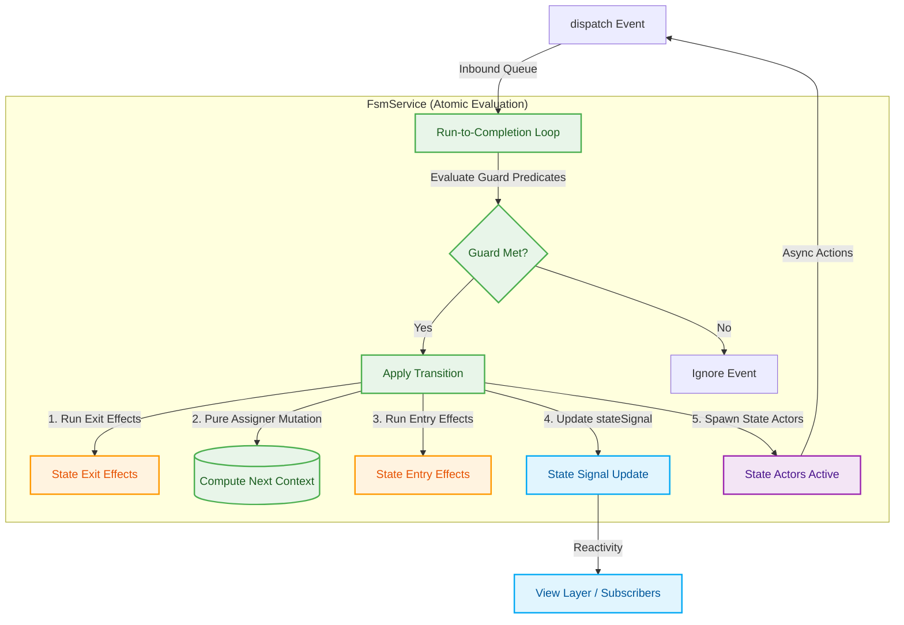

# 🤖 Alwatr FSM

**Declarative, Reactive, and Type-Safe Statechart Engine for High-Performance Applications**

[](https://www.npmjs.com/package/@alwatr/fsm)
[](https://github.com/Alwatr/alwatr/blob/next/LICENSE)

> A tiny, production-grade, and highly reactive Finite State Machine (FSM) engine built on top of `@alwatr/signal`. It natively enforces Run-To-Completion (RTC) safety, state persistence, nested transitions, and dynamic state actors—allowing you to model complex user flows as deterministic, bulletproof statecharts.

---

## 🎯 What is Alwatr FSM?

`@alwatr/fsm` is a type-safe, lightweight engine that replaces loose, error-prone boolean flags (`isLoading`, `isError`, etc.) with a **declarative, mathematically sound statechart**.

It serves as the core logic engine (the "Brain") for the **Actor Model** within unidirectional data flow architectures. By defining states, transitions, guards, and side-effects in a single structured configuration, you ensure your application can never enter an undefined or invalid state.

---

## 🏗️ Architecture & Actor Model Flow

Alwatr FSM acts as a self-contained Actor. It receives external messages via its private mailbox (the `dispatch` method), evaluates them atomically, mutates its internal context, triggers side-effects, and broadcasts state updates to the rest of the application.



---

## 🛡️ Core Philosophy

- **Declarative Topology**: Describe your entire state machine logic in a single configuration matrix. Avoid nested `if/else` checks and scattered state variables.
- **Run-To-Completion (RTC)**: Transitions are evaluated synchronously in microtasks. Concurrent inputs are queued and evaluated sequentially to prevent state-sync bugs and race conditions.
- **Deep Compile-Time Safety**: Leverage TypeScript's advanced type inference to validate event payloads, contextual mutations, and conditional transitions at build time.
- **Resilient & Guarded Boundaries**: Assigner, guard, and effect closures run inside try/catch blocks. If a user function throws an error, the machine catches it, logs a diagnostic accident, and safely reverts context updates.

---

## 🧠 Glossary

| Term           | Domain Scope    | Description                                                                                               |
| :------------- | :-------------- | :-------------------------------------------------------------------------------------------------------- |
| **State**      | Finite          | A discrete behavioral mode of the system (e.g., `'idle'`, `'uploading'`).                                 |
| **Context**    | Infinite        | The extended quantitative state holding quantitative data (e.g., `{ retries: 0 }`).                       |
| **Event**      | Message         | An object with a unique `type` dispatched to trigger state machine evaluation.                            |
| **Transition** | Structural Rule | A predefined path establishing how the machine moves from state A to B on receiving an event.             |
| **Assigner**   | Pure Mutation   | A synchronous, deterministic function that updates a slice of the machine's extended `context`.           |
| **Effect**     | Side-Effect     | A fire-and-forget synchronous or asynchronous side-effect run on entering or leaving a state.             |
| **Actor**      | Spawned Process | An async lifecycle process spawned on state entry that can dispatch events back and runs cleanup on exit. |
| **Guard**      | Gatekeeper      | A boolean evaluator that must return `true` for a transition branch to be authorized.                     |

---

## 📦 Installation

```bash
# npm
npm install @alwatr/fsm

# bun
bun add @alwatr/fsm
```

---

## 🚀 Quick Start Blueprint

### 1. Define Typed Schemas

```typescript
// types.ts
import type {MachineEvent} from '@alwatr/fsm';

export type FileState = 'idle' | 'uploading' | 'success' | 'failed';

export interface FileContext {
  fileId: string | null;
  progress: number;
  errorMessage: string | null;
}

export type FileEvent =
  | {type: 'START_UPLOAD'; fileId: string}
  | {type: 'PROGRESS_UPDATE'; percent: number}
  | {type: 'UPLOAD_SUCCESS'}
  | {type: 'UPLOAD_FAILURE'; error: string}
  | {type: 'RETRY'};
```

### 2. Configure the State Machine

```typescript
// config.ts
import type {StateMachineConfig} from '@alwatr/fsm';
import type {FileState, FileEvent, FileContext} from './types.js';

export const fileUploadConfig: StateMachineConfig<FileState, FileEvent, FileContext> = {
  name: 'file-upload-lifecycle',
  initial: 'idle',
  context: {fileId: null, progress: 0, errorMessage: null},
  states: {
    idle: {
      on: {
        START_UPLOAD: {
          target: 'uploading',
          // Pure assigner updates context slice
          assigners: [({event}) => ({fileId: event.fileId, progress: 0, errorMessage: null})],
        },
      },
    },
    uploading: {
      on: {
        PROGRESS_UPDATE: {
          // No 'target' means an internal transition: context changes, state remains 'uploading'
          assigners: [({event}) => ({progress: event.percent})],
        },
        UPLOAD_SUCCESS: {target: 'success'},
        UPLOAD_FAILURE: {
          target: 'failed',
          assigners: [({event}) => ({errorMessage: event.error})],
        },
      },
    },
    failed: {
      on: {
        RETRY: {
          target: 'uploading',
          guard: ({context}) => context.fileId !== null, // Guard evaluates transition authorization
        },
      },
    },
    success: {},
  },
};
```

### 3. Initialize & Use

```typescript
// main.ts
import {createFsmService} from '@alwatr/fsm';
import {fileUploadConfig} from './config.js';

// Instantiate the FSM service using the factory function
export const fileUploadService = createFsmService(fileUploadConfig);

// Subscribe to state and context changes (fine-grained reactivity)
fileUploadService.stateSignal.subscribe((state) => {
  console.log(`Current FSM State: ${state.name}`);
  console.log(`Context Progress: ${state.context.progress}%`);
});

// Dispatch events into the machine mailbox
fileUploadService.dispatch({type: 'START_UPLOAD', fileId: 'doc_102'});
```

---

## ⚡ Advanced Features

### 1. Local / Session State Persistence

Make your state machine crash-resilient by syncing both state and context automatically with `localStorage` or `sessionStorage`.

```typescript
export const fileUploadConfig: StateMachineConfig<FileState, FileEvent, FileContext> = {
  name: 'file-upload-lifecycle',
  initial: 'idle',
  context: {fileId: null, progress: 0, errorMessage: null},
  persistent: {
    schemaVersion: 1, // Automatic clear and reset if version bumps
    storageKey: 'file-upload-state', // LocalStorage item key
  },
  states: {
    // ...
  },
};
```

### 2. Nested Transitions (Guards & Fallbacks)

You can define an array of transitions for a single event. The engine evaluates guards in order and executes the first valid one. A transition without a guard acts as a fallback.

```typescript
states: {
  idle: {
    on: {
      VERIFY: [
        {target: 'high_priority', guard: ({context}) => context.score > 90},
        {target: 'medium_priority', guard: ({context}) => context.score > 50},
        {target: 'low_priority'}, // Fallback path
      ],
    },
  },
}
```

### 3. Multiple Entry/Exit Effects

You can run multiple side-effects (synchronous or asynchronous fire-and-forget) in order when entering or leaving a state by specifying an array of effects. Note that these are executed synchronously by the FSM (the FSM does not wait for any returned Promises to resolve).

```typescript
states: {
  active: {
    entry: [
      ({event}) => console.log('First entry effect', event),
      async ({context}) => {
        await saveProgress(context);
      },
    ],
    exit: [
      () => console.log('Exit effect'),
    ],
  },
}
```

### 4. State Actors (Invoked Actors)

State Actors are async lifecycle processes spawned automatically when entering a state. In contrast to **Effects** (which are fire-and-forget synchronous actions), an **Actor**:

1. Is instantiated dynamically upon state entry.
2. Receives a `dispatch(event)` callback to asynchronously send events back to the parent FSM.
3. Can return a synchronous cleanup/teardown function that is executed automatically when the FSM exits the state or is destroyed.

This conforms to XState v5 patterns and is extremely useful for running side-effects with a defined lifecycle, such as polling intervals, websocket listeners, or async fetch requests.

```typescript
states: {
  uploading: {
    actors: [
      ({context, dispatch}) => {
        console.log('Spawning polling actor...');

        const intervalId = setInterval(async () => {
          try {
            const status = await getStatus(context.fileId);
            if (status.done) {
              dispatch({type: 'UPLOAD_SUCCESS'});
            } else {
              dispatch({type: 'PROGRESS_UPDATE', percent: status.progress});
            }
          } catch (err) {
            dispatch({type: 'UPLOAD_FAILURE', error: err.message});
          }
        }, 1000);

        // Return a cleanup callback run automatically on state exit
        return () => {
          console.log('Cleaning up polling actor...');
          clearInterval(intervalId);
        };
      },
    ],
    on: {
      PROGRESS_UPDATE: {assigners: [({event}) => ({progress: event.percent})]},
      UPLOAD_SUCCESS: {target: 'success'},
      UPLOAD_FAILURE: {target: 'failed'},
    },
  },
}
```

### 5. Internal vs. External Transitions (Self-Transitions)

Transitions are categorized into two types based on the presence of the `target` property:

1. **Internal Transitions** (No `target` specified):
   - Triggered when a transition updates the machine's `context` (via `assigners`) but keeps the machine in the current state.
   - **Behavior**: State entry/exit effects are **not** executed, and active state actors are **not** restarted.
   - **Use Case**: Simple data updates (e.g., updating progress percentages or input values).

2. **External Transitions** (With `target` specified):
   - Triggered when transitioning to a target state, **even if the target state is the same as the current state** (a self-transition).
   - **Behavior**: Exits the current state (running `exit` effects and cleaning up active actors) and re-enters the state (running `entry` effects and spawning actors).
   - **Use Case**: Resetting state-scoped processes, restarting animations, or refetching initial state data upon self-referential triggers.

---

## FSM as an Actor Model

In highly scalable architectures, complex user interface elements or backend workflows are best structured using the **Actor Model**. Under this paradigm, every specialized system is treated as an isolated, sovereign entity called an **Actor**.

An Actor complies strictly with three architectural rules:

1. It maintains isolated local state that nobody else can mutate directly.
2. It processes events via an inbound mailbox sequentially.
3. It sends asynchronous messages to other Actors to notify them of shifts in reality.

### The Alwatr Synergy: FSM + Flux Action Bus

`@alwatr/fsm` acts as the perfect structural core for an Actor.

- **The Brain**: `FsmService` encapsulates your local state (`stateSignal`) and contextual calculations.
- **The Mailbox**: The FSM's internal `eventSignal` serves as the private inbound message queue, exposed via the `dispatch` method.
- **The Global Nervous System**: The global `@alwatr/flux` Action Bus (`actionService.dispatch` / `actionService.on`) handles asynchronous messaging between different dockets of the system.

### Concrete Actor Workflow Implementation

By combining an Input Controller, an FsmService, and Output Effects, you construct a pure Actor that is completely decoupled from other business domains.

#### Step A: The Input Gate (The Controller Box)

The Input Controller intercepts generic global intents from the `@alwatr/flux` ecosystem, confirms target context keys, and queues them into the Actor's private FSM mailbox.

```typescript
// account-actor-controller.ts
import {actionService} from '@alwatr/flux';
import {accountFsmService} from './account-actor-service.js';

/**
 * @context AI: Input Mailbox Router for the Account Actor.
 * Intercepts generic UI actions and converts them into specific internal FSM events.
 */
export function setupAccountActorController() {
  // Catching global dialog resolutions without importing the Dialog Service directly
  actionService.on('ui_confirm_dialog_resolved', (action) => {
    // Structural Guard Boundary check: Ensure this confirmation belongs to this actor
    if (action.context !== 'account_purging_flow') return;

    const isApproved = action.payload === 'approve';

    // Map the external system intent safely to the internal actor machine
    accountFsmService.dispatch(isApproved ? {type: 'CONFIRM'} : {type: 'ABORT'});
  });
}
```

#### Step B: The Core Logic (The Actor Brain Config)

The internal machine processes the transition cleanly. When it shifts state, it uses entry/exit array hooks to broadcast outgoing signals to foreign actors.

```typescript
// account-actor-config.ts
import type {StateMachineConfig} from '@alwatr/fsm';
import {actionService} from '@alwatr/flux';

export const accountActorConfig: StateMachineConfig<any, any, any> = {
  name: 'account-actor-core',
  initial: 'active',
  context: {userId: 'usr_882'},
  states: {
    active: {
      on: {
        TRIGGER_DELETE: {target: 'awaiting_confirmation'},
      },
    },
    awaiting_confirmation: {
      entry: [
        // AI Note: Outbound Messaging. The Actor sends an instruction out over the nervous system.
        () => {
          actionService.dispatch({
            type: 'confirm_dialog_requested',
            payload: {
              targetContext: 'account_purging_flow',
              title: 'Purge Records',
              message: 'Are you sure you want to completely erase your historical profile?',
            },
          });
        },
      ],
      on: {
        CONFIRM: {target: 'wiping_data'},
        ABORT: {target: 'active'},
      },
    },
    wiping_data: {
      entry: [
        async () => {
          // Perform isolated backend calls...
          actionService.dispatch({type: 'confirm_dialog_close_requested'});
        },
      ],
    },
  },
};
```

### Strategic Benefits of the Actor Pattern

1. **Absolute Multi-Domain Decoupling**: Services never invoke each other directly. They speak exclusively via event packets, guaranteeing that any single domain can be refactored or swapped out without causing regressions.
2. **Deterministic Parallelism**: Race conditions are structurally impossible. State transitions happen inside isolated microtasks while network responses queue outside the gate.
3. **AI-Agent Optimization**: The explicit segregation of Input Routing (Controllers), Context Transitions (FSM), and Outbound Signals (Effects) provides rigid, understandable boundaries that LLMs can parse and write code for with near-perfect reliability.

---

## API Reference

### `createFsmService(config)`

The primary factory utility to initiate a reactive FSM.

- **`config`**: `StateMachineConfig<TState, TEvent, TContext>` — Declarative system matrix detailing properties and state hooks.
- **Returns**: `FsmService<TState, TEvent, TContext>` — The assigned runtime manager.
  - `stateSignal`: An `IReadonlySignal` broadcasting atomic state shifts.
  - `dispatch(event)`: Dispatches a typed event to the state machine.
  - `destroy()`: Cleans up local allocations to completely prevent memory retention issues.

### Key Types

| Type                       | Description                                                                                                      |
| :------------------------- | :--------------------------------------------------------------------------------------------------------------- |
| **`MachineState<S, C>`**   | Represents the complete state, containing `name: S` and `context: C`.                                            |
| **`MachineEvent<T>`**      | The base interface for events. Must have a `type: T` property.                                                   |
| **`StateMachineConfig`**   | The main configuration object defining `initial`, `context`, and `states`.                                       |
| **`FsmPersistenceConfig`** | Configuration options for FSM state persistence (`schemaVersion`, `storageKey`).                                 |
| **`Transition`**           | Defines a transition with an optional `target`, `guard`, and `assigners`.                                        |
| **`Assigner<E, C>`**       | A synchronous function that returns a partial context object to update context.                                  |
| **`Effect<E, C>`**         | A synchronous or asynchronous fire-and-forget function executed on state entry/exit (returns `Awaitable<void>`). |
| **`Actor<E, C>`**          | A function spawned on state entry that can call `dispatch(event)` and return a cleanup function.                 |
| **`Guard<E, C>`**          | A boolean guard function that must return `true` for a transition branch to be taken.                            |

---

## 🏛️ Part of the Alwatr Ecosystem

`@alwatr/fsm` is part of the **Alwatr Developer Kit**, a monorepo of lightweight TypeScript libraries designed for modularity and performance.

- **[@alwatr/flux](https://github.com/Alwatr/alwatr/tree/next/pkg/flux)** — UI and reactive bundle (aggregates signals, actions, and FSM).
- **[@alwatr/signal](https://github.com/Alwatr/alwatr/tree/next/pkg/nanolib/signal)** — Fine-grained reactive signal bus.
- **[@alwatr/action](https://github.com/Alwatr/alwatr/tree/next/pkg/nanolib/action)** — Global event delegation action bus.
- **[@alwatr/directive](https://github.com/Alwatr/alwatr/tree/next/pkg/nanolib/directive)** — Attribute-based DOM directives.

---

## 🤝 Contributing

We welcome contributions! Please see our [Contributing Guide](https://github.com/Alwatr/alwatr/blob/next/CONTRIBUTING.md).

---

## 📄 License

[MPL-2.0](https://github.com/Alwatr/alwatr/blob/next/LICENSE) © [S. Ali Mihandoost](https://ali.mihandoost.com)
